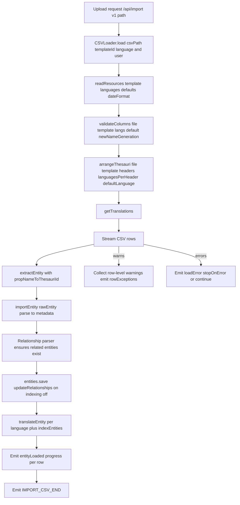
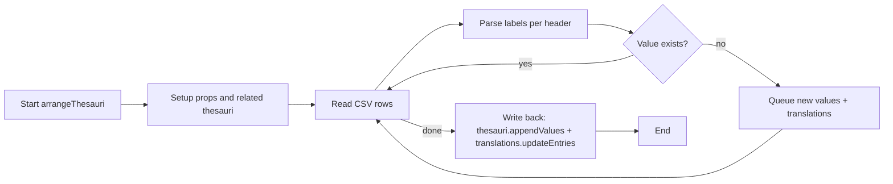
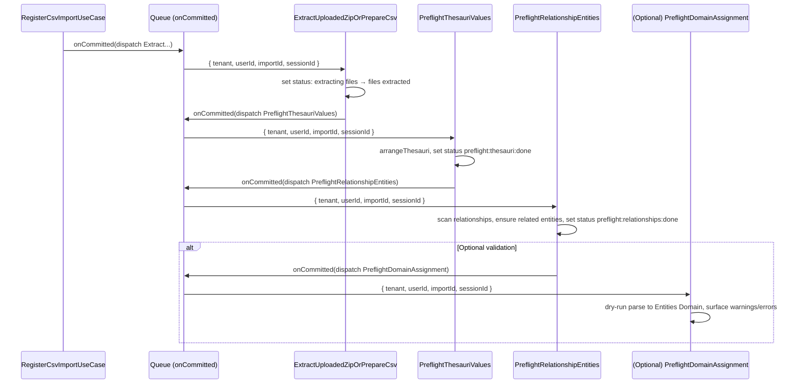

## CSV Import V2 — Context Doc 03

Date: 2025-11-17
Owner: CSV Import V2 initiative

### Purpose

Deep-dive into the legacy CSV Import (V1) flow with emphasis on its “preflight” behavior, to align how we will migrate this to V2 jobs. This document consolidates how V1 validated columns, created missing thesaurus values, and created missing related entities, and proposes the V2 preflight job breakdown and ToDos.

### How to use this document (Agent Handoff)

This is a living, authoritative context for CSV Import V2. Its goals:

- Capture decisions, constraints, interfaces, and sequencing so new agents can resume seamlessly.
- Prefer V2 architecture (entities.v2, use cases, transaction-aware DS) and record when/why we deviate.
- Keep ToDos actionable and always up to date with the current state of implementation.
- Include naming, event conventions, and testing expectations so flows remain consistent across jobs.

When continuing work:

- Read Context 01 → 02 → 03 (this file) in order.
- Respect feature flags and job sequencing defined here.
- Prefer creating the missing V2 DS/service rather than calling V1 APIs directly. If a V2 DS must wrap V1, document the gap and add ToDos.
- Maintain idempotency and transaction boundaries as specified (file IO outside TM; DB changes inside TM).

### Scope recap (from Context 01 and 02)

- Architecture: V2 hexagonal, job-processed stages after a quick upload response.
- Collection: `csv_imports` stores import state and metadata.
- Storage: Files.v2 under `csv-imports/{importId}`; canonical extracted CSV at `extracted/import.csv`.
- Routing: `POST /api/import`, admin-only, feature-flagged via `v2CSVImport`.
- MVP statuses so far: `queued` → `extracting files` → `files extracted`.
- Events: Job-scoped session notifications, not tenant-wide broadcasts.

### Legacy CSV Import (V1) — Preflight and Import Flow (Deep Dive)

The legacy flow is executed via the non-v2-flagged route, which directly constructs a `CSVLoader` and processes the upload immediately on the request thread:

- Entry: `app/api/csv.v2/routes/routes.ts` → `v1Import(...)` (when `v2CSVImport` is disabled) → `new CSVLoader().load(...)`.
- Core flow in `app/api/csv/csvLoader.ts`:
  - `validateColumns(...)` (headers/layout validation)
  - `arrangeThesauri(...)` (discover and create missing thesaurus values + update translations)
  - `csv(...).onRow(...)` for each row:
    - `extractEntity(...)` to split per-language row into `rawEntity` + translations
    - `importEntity(...)` to build metadata (via type parsers) and save the entity
    - `translateEntity(...)` to persist language variants and index
  - Emits event signals: progress, row exceptions, and errors

#### High-level sequence (V1)

#### Column validation

- File: `app/api/csv/validateColumns.ts`
- Validates header consistency:
  - No mixing language-suffixed and non-suffixed columns for the same property.
  - Only certain property types allow language-suffixed headers.
  - Language-suffixed headers must include the default language column.

#### Thesauri pre-arrangement (creates missing values)

- File: `app/api/csv/arrangeThesauri.ts`
- Inputs: CSV stream, template, headers/language info.
- Behavior:
  - Determine which template properties map to thesauri (`select`, `multiselect`).
  - For each row/header, parse labels (parent/child semantics) using normalization and fallbacks.
  - Accumulate “new” values (and children) not present in the thesaurus.
  - After scanning the entire file:
    - Append missing values into the relevant thesauri.
    - Update translations for newly added thesaurus values.
  - Throws `ArrangeThesauriError` on deterministic violations (e.g., a label used as a group header elsewhere).

#### Relationship parsing (creates missing related entities)

- File: `app/api/csv/typeParsers/relationship.ts`
- For each relationship property on the row:
  - Parse the multi-value string into unique titles.
  - Query existing entities by title (and optional template restriction).
  - For any missing titles, create new entities (with the property’s `content` template if provided).
  - Fetch the set again and return related values as `{ value: sharedId, label: title }` for metadata.

Key takeaway: V1 creates missing related entities “on the fly” during row parsing, not as a prior global preflight step.

#### Select / Multiselect parsing (maps labels to thesaurus values)

- Files: `app/api/csv/typeParsers/select.ts`, `app/api/csv/typeParsers/multiselect.ts`, `app/api/csv/typeParsers/shared.ts`
- Behaviors:
  - Normalize labels, support parent/child syntax, and handle `::` fallback form.
  - Generate metadata values by resolving thesaurus item ids; emit warnings when not found or format invalid.
  - Multiselect aggregates multiple values and surfaces parsing failures as warnings.

#### Entity creation and translations

- File: `app/api/csv/importEntity.ts`
- Steps per row:
  - Build entity metadata via type parsers (including relationship and thesauri-backed props).
  - Save entity with `{ updateRelationships: true, index: false }`.
  - Handle file/attachments if provided (store and process).
  - For translations: derive per-language variants from the row and save them; then index entities.

#### Events and errors

- Route-level events: `IMPORT_CSV_START`, `IMPORT_CSV_PROGRESS`, `IMPORT_CSV_END`, `IMPORT_CSV_ERROR`, `IMPORT_CSV_ROW_EXCEPTIONS` emitted to the request session.
- Error handling:
  - Row-level warnings (e.g., sanitization issues, unmatched thesaurus labels) are collected during parsing and emitted as grouped `rowExceptions` after the pass.
  - Fatal errors per row trigger `.onError(...)`. With `stopOnError = true`, processing stops at the first fatal error; otherwise it attempts to continue and throws at the end. This is why V1 can both emit grouped warnings and still fail early on hard errors.

### Implications for V2 Preflight

- V1 “preflight” is split across two places:
  - Global thesauri pre-arrangement (before row processing): creates any missing thesaurus values and updates translations.
  - Per-row relationship parsing: creates missing related entities on demand.
- For V2, we should:
  - Keep “global thesauri pre-arrangement” as a dedicated job, executed after extraction and before main entity import.
  - Consider extracting relationship pre-creation into a dedicated preflight job that scans the canonical `import.csv` once and creates all missing related entities deterministically, rather than on-the-fly during entity creation.
  - Optionally add a “domain assignment/validation” preflight: build Entities Domain objects without persisting to surface structural errors earlier, improving feedback prior to heavy writes.

### V2-first approach and dependencies

- Entities: Use entities.v2 Domain and services for any entity creation (including related entities created by preflight). Entities.v2 supports system-driven minimal creations (title + template only) where required-property enforcement can be bypassed as intended.
- Thesauri: There is no full thesauri.v2 yet. Use the available DS that wraps V1 operations; extend it (V2-style) with explicit append/update methods as needed, after discussion.
- Data sources: All DS must be transaction-aware (extend `MongoDataSource`), using `transactionManager.run(...)` for writes. Do not bypass TM by calling raw collections.
- Jobs and use cases: Jobs only orchestrate; business logic lives in use cases. File IO occurs outside TM; DB writes occur inside TM. Chain jobs via `transactionManager.onCommitted(...)`.

### Proposed V2 Job Pipeline Additions (Preflight)

- After `files extracted`:
  1. `CsvPreflightThesauriValuesUseCase` + Job
     - Reads `extracted/import.csv` and the target template.
     - Replicates V1 `arrangeThesauri` behavior with domain/DS patterns and transactions.
     - On success: set status to `preflight:thesauri:done` (or keep in `preflight` with a substage field if we add `stages` later).
     - Emits: `csvImport:preflight:thesauri:start|progress|success|error` to session.
  2. `CsvPreflightRelationshipEntitiesUseCase` + Job
     - Scans `extracted/import.csv`; for each relationship property and unique title, ensures related entities exist (using the property’s `content` template restriction).
     - Matches V1 `relationship.ts` creation semantics but as a global preflight pass for determinism.
     - On success: set status to `preflight:relationships:done`.
     - Emits: `csvImport:preflight:relationships:start|progress|success|error`.
  3. (Optional, to discuss) `CsvPreflightDomainAssignmentUseCase` + Job
     - Reads rows and attempts to build domain-level entity models without persisting, applying parsers and validations.
     - Produces a report of warnings/errors (akin to `rowExceptions`), allowing early surfacing of data issues.
     - On success: set status to `preflight:validated`; otherwise, persist a failure descriptor and set `failed` or `retrying` per policy.

### Design notes for preflight jobs (V2 patterns)

- Transactions and storage:
  - Reads from `csv-imports/{id}/extracted/import.csv`.
  - DS are transaction-aware; write updates inside `transactionManager.run(...)`.
  - Use `onCommitted` for dispatching the next job in the pipeline.
- Idempotency:
  - Jobs should tolerate re-execution. V1’s thesauri append is naturally append-only; ensure the relationship preflight checks for existence before create.
- Progress/events:
  - Emit to session only; heartbeat on row progress to renew locks.
  - Keep concise per-stage event names under `csvImport:preflight:*` prefix.
- Failure classification:
  - Deterministic policy errors → `NonRetryableJobError`, mark `failed`.
  - Transient IO/DB → propagate; job runner handles `retrying`, set status accordingly.
- Output state:
  - Persist minimal `failure` object `{ message, retryable, at, stage }` for support visibility (as affirmed in Context 02).

### Event naming (V2, finalized for preflight)

- Extraction: `csvImport:extract:start|progress|success|error`
- Preflight (thesauri): `csvImport:preflight:thesauri:start|progress|success|error`
- Preflight (relationships): `csvImport:preflight:relationships:start|progress|success|error`
- Preflight (validation/domain assignment, optional): `csvImport:preflight:validate:start|progress|success|error`

### Open questions / discussion

- Relationship preflight: global vs. per-row creation semantics
  - Decision: Jobs are sequential and always trigger the next (even when a stage is effectively a no-op). Thesauri preflight always runs and upon completion triggers relationships preflight.
  - Template scoping (definition): when a relationship property sets `content`, related entity creation must be restricted to that target template. Matching and creation happen under that template scope only.
  - MVP related entities payload: Only `title` and `template`. Creation must use entities.v2 Domain, leveraging the minimal-creation path that bypasses “required” property checks.
- Optional domain assignment preflight scope
  - Options (to be discussed after thesauri + relationships preflight are finalized):
    - Dry-run validation only: build Domain objects, do not persist; produce a full per-row error report.
    - Full preflight: build Domain objects and persist as the actual import (benefit: single pass; trade-offs: rollback/stop policy).
  - Error policy (directional): proceed through all rows, aggregate errors, and report comprehensively at the end (plus a downloadable CSV of failed rows). Introduce stop conditions for pathological cases (e.g., abort after N consecutive failures or an excessive failure ratio).
- Event naming consistency
  - Decision: Use new V2 events only as listed above; do not reuse V1 events.

### Performance model (proposal)

- Single-pass row staging: After extraction, read `extracted/import.csv` once and persist normalized, tenant-scoped row representations (e.g., a `csv_import_rows` collection keyed by `importId`, with row index, original values, and normalized forms needed by downstream parsers).
- Subsequent jobs (thesauri preflight, relationships preflight, optional validation/import) reuse staged rows to avoid re-reading/parsing the CSV multiple times.
- Benefits:
  - Avoid repeated `entities.find` per row; relationships preflight can compute the set of missing titles first and perform batched resolves/creates per target template.
  - Deterministic sequencing and easier idempotency/retries at row granularity.
- Considerations:
  - Storage overhead is acceptable during import lifetime; define retention/cleanup policy.
  - Ensure staging captures enough normalized data so later stages don’t recompute expensive parsing.

### Batching model (proposal)

- Rationale:
  - Avoid spawning per-row jobs (e.g., 100k jobs) since workers process jobs sequentially and we typically run multiple worker instances. Batching reduces queue pressure, improves throughput, and simplifies lock/heartbeat handling.
- Scope:
  - Prefer batch processing for row-driven stages (relationships preflight, optional validation, and main import). Thesauri preflight may remain single-job (streaming pass) unless profiling indicates batching is needed.
- Approach:
  - Row staging prerequisite: persist normalized rows once (see Performance model) and track total row count.
  - Batch definition: contiguous slices by row index, with configurable `batchSize` (e.g., 500–5000). Store progress in `csv_imports` using row-centric fields (e.g., `progress: { totalRows, processedRows, lastProcessedRow, batchSize }`) so user-facing progress reflects rows, not abstract batches.
  - Dispatch model:
    - Option A (chained): dispatch the next batch from `onCommitted` of the previous batch to limit concurrency per import.
    - Option B (pre-dispatch window): enqueue N upcoming batches capped to a window; each batch on success enqueues the next window segment (throttled).
    - Partitioning: ensure queue partitioning by `importId` to avoid interleaved batches across different imports if required.
    - Option C (eager dispatch): enqueue all batches upfront (`ceil(totalRows / batchSize)` jobs). Pros: maximizes horizontal scaling across multiple worker instances. Cons: risks queue flooding and unfairness across tenants/imports; requires strong idempotency and per-import concurrency caps at worker level to prevent stampedes. Consider an upper bound on total enqueued batches per import (or global), and optionally combine with Option B (windowed eager) as a hybrid.
  - Relationships preflight specifics:
    - Two-phase batched plan:
      1. Collect distinct relationship titles per target template across staged rows (batched aggregation over row slices; results stored in a temporary, import-scoped set).
      2. Compute missing titles (existing vs. requested) and perform bulk, idempotent creation per template (batched write, retry-safe).
  - Optional validation or import stage:
    - Process rows in batches; persist progress fields so retries resume from the last successful batch.
    - Emit progress with `{ batchIndex, batchCount, rowsProcessed }`; heartbeat periodically inside each batch.
  - Idempotency & retries:
    - Each batch must be safe to re-run (no duplicate writes; or use upserts/unique constraints).
    - Prefer row-based idempotency: avoid batch-completion markers; rely on upserts/existence checks and row checkpoints (`processedRows`/`lastProcessedRow`) so out-of-order or repeated batches do not double-count.
  - Error policy per batch:
    - Accumulate per-row errors within the batch.
    - Introduce stop thresholds (e.g., abort import if failure ratio exceeds X% over Y consecutive batches).
  - Lock configuration:
    - Ensure lock window accommodates `batchSize`; call `heartbeat()` periodically during batch processing.
  - Tuning:
    - Make `batchSize` configurable; add telemetry to later tune (`duration per batch`, `errors per batch`) and consider adaptive sizing in follow-ups.

### Retention and cleanup policy (proposal)

- Original upload:
  - Path: `csv-imports/{importId}/{uploadedFilename}` (zip or csv).
  - Policy: delete immediately after successful extraction/copy to `extracted/import.csv` (schedule via `transactionManager.onCommitted` to ensure DB state is persisted first).
- Extracted artifacts:
  - Path: `csv-imports/{importId}/extracted/` (contains `import.csv` and any unzipped support files).
  - Policy: retain through the end of all preflight and import jobs. After the import completes (success or terminal failure), delete the entire `extracted/` directory unless a configured retention window applies (e.g., keep N days for debugging). If retention applies, a periodic cleanup should remove expired artifacts.
- Staged rows (if implemented):
  - Collection: `csv_import_rows` keyed by `importId`.
  - Policy: delete after import completes or is terminally failed/cancelled, optionally honoring a retention window for debugging/traceability.
- Attachments and files imported into entities:
  - These are moved into documents storage during import; they are not part of the `csv-imports/{importId}` lifecycle and should not be deleted.
- Failures/cancellations:
  - On non-retriable failure or on cancellation, keep artifacts until a retention deadline, then clean up (files and any staged rows). Persist a concise failure descriptor in DB so artifacts are not needed to understand the cause.
- Implementation:
  - All deletes should be idempotent and safe to re-run.
  - Use per-tenant `PathManager` and files.v2 storage interface (`customPath`) for deletes.
  - Trigger synchronous cleanup at stage boundaries via `onCommitted` where appropriate (e.g., delete original after extract), and register a final “import finalizer” job to apply policy on completion or terminal failure.

### ToDos (near-term, preflight)

- Define preflight statuses and (temporary) event names under `csvImport:preflight:*`.
- Implement `CsvPreflightThesauriValuesUseCase`:
  - Mirror V1 `arrangeThesauri` parsing and save behavior with domain/DS patterns and transactions.
  - Write tests: happy path, invalid formats, translation updates, idempotency.
- Implement `CsvPreflightRelationshipEntitiesUseCase`:
  - Scan canonical CSV, collect unique titles per relationship property (respecting `content` template).
  - Create any missing related entities; ensure idempotent re-runs.
  - Write tests: creation, template filtering, duplicates, retries.
- (Optional) Implement `CsvPreflightDomainAssignmentUseCase`:
  - Dry-run parse of rows into Entities Domain objects, collect warnings/errors.
  - Persist a concise report in `csv_imports.failure` or a future `errors` field; emit session events.
- Wire jobs and dispatch:
  - Register jobs, inject factories per V2 conventions, and chain via `transactionManager.onCommitted` from extraction → preflight stages.
- Event emissions:
  - Use `V1WebSocketsWrapper.emitToSession(sessionId, ...)` for `start|progress|success|error` per preflight job.
- Integration tests:
  - Real Mongo via DS factories and TM, real FS (`FileSystemStorage` + `PathManager`), and real `FileContentsIO`.
  - Use `SyncDispatcherForTests` or a `RecordingDispatcher` as appropriate to validate sequencing.
- Cleanup & retention ToDos:
  - Delete original upload in `csv-imports/{id}/{uploadedFilename}` after successful extract/copy to `extracted/import.csv` (dispatch via `onCommitted`).
  - Implement finalizer job to remove `csv-imports/{id}/extracted/` and staged rows after import completion or terminal failure, honoring an optional retention window.
  - Add configuration for retention window (days) and a periodic sweeper to remove expired artifacts across tenants.
  - Ensure all file deletions and staged rows cleanup are idempotent and safe under retries.
- Batching ToDos:
- Define `batchSize` config and progress schema on `csv_imports` (totalRows, processedRows, lastProcessedRow, batchSize).
- Implement batched relationship preflight: distinct titles aggregation per template (phase 1) and bulk creation (phase 2).
- Implement batch dispatcher strategy (chained or windowed) with partitioning by `importId`.
- Extend progress events to include `{ batchIndex, batchCount, rowsProcessed }` and ensure periodic heartbeat within batches.
- Add large-scale tests (e.g., 50k–100k rows): performance, retries, idempotent batch re-execution, and stop thresholds.
- Evaluate dispatch strategy:
- Add configs for `maxConcurrentBatchesPerImport` and `maxQueuedBatchesPerImport` to support Option C (eager dispatch) safely (or a hybrid with Option B).
- Ensure fairness across tenants/imports and prevent queue flooding; add metrics for queue depth per import/tenant and worker utilization.

### References (V1 code pathways)

- Route to v1 flow: `app/api/csv.v2/routes/routes.ts` → `v1Import`
- Loader: `app/api/csv/csvLoader.ts`
- Columns validation: `app/api/csv/validateColumns.ts`
- Thesauri arrangement: `app/api/csv/arrangeThesauri.ts`
- Relationship parser: `app/api/csv/typeParsers/relationship.ts`
- Select/multiselect parsers: `app/api/csv/typeParsers/select.ts`, `app/api/csv/typeParsers/multiselect.ts`, `app/api/csv/typeParsers/shared.ts`
- Entity import/translation: `app/api/csv/importEntity.ts`
