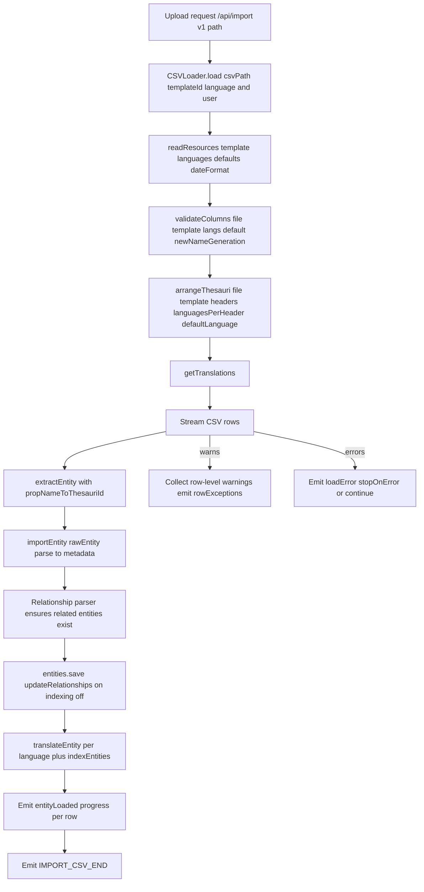
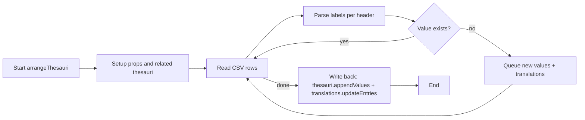
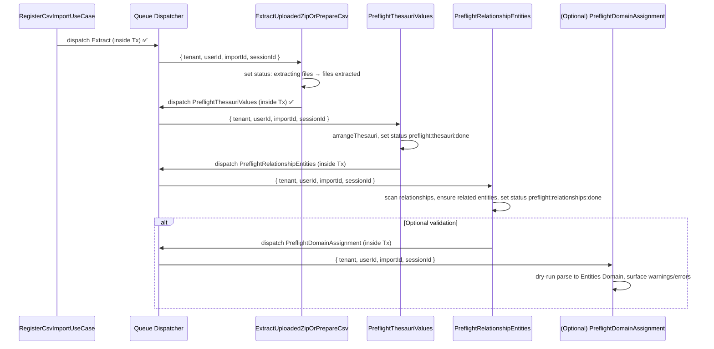

## CSV Import V2 — Context Doc 03

Date: 2025-11-17
Owner: CSV Import V2 initiative

### Purpose

Deep-dive into the legacy CSV Import (V1) flow with emphasis on its “preflight” behavior, to align how we will migrate this to V2 jobs. This document consolidates how V1 validated columns, created missing thesaurus values, and created missing related entities, and proposes the V2 preflight job breakdown and ToDos.

### How to use this document (Agent Handoff)

This is a living, authoritative context for CSV Import V2. Its goals:

- Capture decisions, constraints, interfaces, and sequencing so new agents can resume seamlessly.
- Prefer V2 architecture (entities.v2, use cases, transaction-aware DS) and record when/why we deviate.
- Keep ToDos actionable and always up to date with the current state of implementation.
- Include naming, event conventions, and testing expectations so flows remain consistent across jobs.

When continuing work:

- Read Context 01 → 02 → 03 (this file) in order.
- Respect feature flags and job sequencing defined here.
- Prefer creating the missing V2 DS/service rather than calling V1 APIs directly. If a V2 DS must wrap V1, document the gap and add ToDos.
- Maintain idempotency and transaction boundaries as specified (file IO outside TM; DB changes inside TM).

### Scope recap (from Context 01 and 02)

- Architecture: V2 hexagonal, job-processed stages after a quick upload response.
- Collection: `csv_imports` stores import state and metadata.
- Storage: Files.v2 under `csv-imports/{importId}`; canonical extracted CSV at `extracted/import.csv`.
- Routing: `POST /api/import`, admin-only, feature-flagged via `v2CSVImport`.
- MVP statuses so far: `queued` → `extracting files` → `files extracted`.
- Events: Job-scoped session notifications, not tenant-wide broadcasts.
- **Naming convention (Nov 2025)**: application-layer jobs live in `app/api/csv.v2/application/jobs/*Job.ts` (e.g., `CsvExtractUploadedZipJob`, `CsvPreflightJob`). Queue wrappers now live in `app/api/csv.v2/infrastructure/queue/*JobDispatcher.ts`. References to “job” in this doc always mean the application-layer class unless explicitly stated.

### Current module layout & naming (Nov 2025)

- `app/api/csv.v2/application/` holds the job/business logic:
  - `jobs/*Job.ts` are the actual application-layer jobs (e.g., `CsvExtractUploadedZipJob`, `CsvPreflightJob`).
  - `services/` contains helpers such as `CsvHeaderAnalyzer`, `CsvReader`, `CsvThesauriPendingValuesBuilder`.
  - `contracts/` declares DS interfaces (`CsvImportsDataSource`, `CsvImportRowsDataSource`, `CsvImportThesauriValuesDataSource`, etc.).
- `app/api/csv.v2/infrastructure/queue/*JobDispatcher.ts` hosts the queue dispatchers that wrap each job.
- `app/api/csv.v2/infrastructure/mongodb/` holds Mongo DS implementations (imports, rows, **thesauri pending-values** storage).
- `app/api/csv.v2/domain/` exposes `CsvImport`, `CsvImportRow`, `CsvThesauriPendingValues`, and `CsvImportThesauriValues`.
- `app/api/csv.v2/specs/` holds integration helpers + shared fixtures (e.g., `zipData`, upload temp directories) so v2 tests no longer reach into the v1 folder.
- `csv_import_thesauri_values` (new Mongo collection) stores per-thesaurus pending-value documents until the apply job runs.

Whenever this doc or the addenda mention “Job”, assume the application-layer class (`*Job.ts`). “Dispatcher” refers to the queue wrapper under `infrastructure/queue/*JobDispatcher.ts`.

### Legacy CSV Import (V1) — Preflight and Import Flow (Deep Dive)

The legacy flow is executed via the non-v2-flagged route, which directly constructs a `CSVLoader` and processes the upload immediately on the request thread:

- Entry: `app/api/csv.v2/routes/routes.ts` → `v1Import(...)` (when `v2CSVImport` is disabled) → `new CSVLoader().load(...)`.
- Core flow in `app/api/csv/csvLoader.ts`:
  - `validateColumns(...)` (headers/layout validation)
  - `arrangeThesauri(...)` (discover and create missing thesaurus values + update translations)
  - `csv(...).onRow(...)` for each row:
    - `extractEntity(...)` to split per-language row into `rawEntity` + translations
    - `importEntity(...)` to build metadata (via type parsers) and save the entity
    - `translateEntity(...)` to persist language variants and index
  - Emits event signals: progress, row exceptions, and errors

#### High-level sequence (V1)

#### Column validation

- File: `app/api/csv/validateColumns.ts`
- Validates header consistency:
  - No mixing language-suffixed and non-suffixed columns for the same property.
  - Only certain property types allow language-suffixed headers.
  - Language-suffixed headers must include the default language column.

#### Thesauri pre-arrangement (creates missing values)

- File: `app/api/csv/arrangeThesauri.ts`
- Inputs: CSV stream, template, headers/language info.
- Behavior:
  - Determine which template properties map to thesauri (`select`, `multiselect`).
  - For each row/header, parse labels (parent/child semantics) using normalization and fallbacks.
  - Accumulate “new” values (and children) not present in the thesaurus.
  - After scanning the entire file:
    - Append missing values into the relevant thesauri.
    - Update translations for newly added thesaurus values.
  - Throws `ArrangeThesauriError` on deterministic violations (e.g., a label used as a group header elsewhere).

#### Relationship parsing (creates missing related entities)

- File: `app/api/csv/typeParsers/relationship.ts`
- For each relationship property on the row:
  - Parse the multi-value string into unique titles.
  - Query existing entities by title (and optional template restriction).
  - For any missing titles, create new entities (with the property’s `content` template if provided).
  - Fetch the set again and return related values as `{ value: sharedId, label: title }` for metadata.

Key takeaway: V1 creates missing related entities “on the fly” during row parsing, not as a prior global preflight step.

#### Select / Multiselect parsing (maps labels to thesaurus values)

- Files: `app/api/csv/typeParsers/select.ts`, `app/api/csv/typeParsers/multiselect.ts`, `app/api/csv/typeParsers/shared.ts`
- Behaviors:
  - Normalize labels, support parent/child syntax, and handle `::` fallback form.
  - Generate metadata values by resolving thesaurus item ids; emit warnings when not found or format invalid.
  - Multiselect aggregates multiple values and surfaces parsing failures as warnings.

#### Entity creation and translations

- File: `app/api/csv/importEntity.ts`
- Steps per row:
  - Build entity metadata via type parsers (including relationship and thesauri-backed props).
  - Save entity with `{ updateRelationships: true, index: false }`.
  - Handle file/attachments if provided (store and process).
  - For translations: derive per-language variants from the row and save them; then index entities.

#### Events and errors

- Route-level events: `IMPORT_CSV_START`, `IMPORT_CSV_PROGRESS`, `IMPORT_CSV_END`, `IMPORT_CSV_ERROR`, `IMPORT_CSV_ROW_EXCEPTIONS` emitted to the request session.
- Error handling:
  - Row-level warnings (e.g., sanitization issues, unmatched thesaurus labels) are collected during parsing and emitted as grouped `rowExceptions` after the pass.
  - Fatal errors per row trigger `.onError(...)`. With `stopOnError = true`, processing stops at the first fatal error; otherwise it attempts to continue and throws at the end. This is why V1 can both emit grouped warnings and still fail early on hard errors.

### Implications for V2 Preflight

- V1 “preflight” is split across two places:
  - Global thesauri pre-arrangement (before row processing): creates any missing thesaurus values and updates translations.
  - Per-row relationship parsing: creates missing related entities on demand.
- For V2, we should:
  - Keep “global thesauri pre-arrangement” as a dedicated job, executed after extraction and before main entity import.
  - Consider extracting relationship pre-creation into a dedicated preflight job that scans the canonical `import.csv` once and creates all missing related entities deterministically, rather than on-the-fly during entity creation.
  - Optionally add a “domain assignment/validation” preflight: build Entities Domain objects without persisting to surface structural errors earlier, improving feedback prior to heavy writes.

### V2-first approach and dependencies

- Entities: Use entities.v2 Domain and services for any entity creation (including related entities created by preflight). Entities.v2 supports system-driven minimal creations (title + template only) where required-property enforcement can be bypassed as intended.
- Thesauri (strict V2 boundary):
  - Do NOT call legacy `arrangeThesauri` or any v1 csv functions from v2 code.
  - Implement a V2 data source that extends `MongoDataSource` and operates on `dictionaries` via `this.getCollection()` so that writes participate in the active transaction.
  - The DS MUST expose explicit append/update methods (e.g., `appendValues(thesaurusId, values)`) and MUST be transaction-aware. If a v1 wrapper is ever needed for read convenience, it must not be used for writes.
- Data sources: All DS must be transaction-aware (extend `MongoDataSource`), using `transactionManager.run(...)` for writes. Do not bypass TM by calling raw collections.
- Jobs and use cases: Jobs orchestrate stage boundaries and own the `transactionManager.run` calls; heavy business logic lives in dedicated services/use cases invoked by the job. File IO occurs outside TM; DB writes occur inside TM. Chain jobs by dispatching the next stage from inside the same `transactionManager.run` block once the DB update succeeds (no `onCommitted` hop for queue dispatch).

### Proposed V2 Job Pipeline Additions (Preflight)

- After `files extracted` (now implemented in code):
  1. `CsvPreflightJob` (preflight preparation)
     - Reads `extracted/import.csv` and the target template.
     - Replicates V1 `arrangeThesauri` behavior with domain/DS patterns and transactions.
     - On success: set status to `preflight:thesauri:done` (or keep in `preflight` with a substage field if we add `stages` later).
     - Emits: `csvImport:preflight:thesauri:start|progress|success|error` to session.
  2. `CsvPreflightRelationshipEntitiesUseCase` + Job
     - Scans `extracted/import.csv`; for each relationship property and unique title, ensures related entities exist (using the property’s `content` template restriction).
     - Matches V1 `relationship.ts` creation semantics but as a global preflight pass for determinism.
     - On success: set status to `preflight:relationships:done`.
     - Emits: `csvImport:preflight:relationships:start|progress|success|error`.
  3. (Optional, to discuss) `CsvPreflightDomainAssignmentUseCase` + Job
     - Reads rows and attempts to build domain-level entity models without persisting, applying parsers and validations.
     - Produces a report of warnings/errors (akin to `rowExceptions`), allowing early surfacing of data issues.
     - On success: set status to `preflight:validated`; otherwise, persist a failure descriptor and set `failed` or `retrying` per policy.

### Design notes for preflight jobs (V2 patterns)

- Transactions and storage:
  - Reads from `csv-imports/{id}/extracted/import.csv`.
  - DS are transaction-aware; write updates inside `transactionManager.run(...)`.
- Dispatch the next job from inside the same `transactionManager.run(...)` block that just persisted the stage’s state change; avoid `onCommitted` for queue chaining.
- Idempotency:
  - Jobs should tolerate re-execution. V1’s thesauri append is naturally append-only; ensure the relationship preflight checks for existence before create.
- Progress/events:
  - Emit to session only; heartbeat on row progress to renew locks.
  - Keep concise per-stage event names under `csvImport:preflight:*` prefix.
- Failure classification:
  - Deterministic policy errors → `NonRetryableJobError`, mark `failed`.
  - Transient IO/DB → propagate; job runner handles `retrying`, set status accordingly.
- Output state:
  - Persist minimal `failure` object `{ message, retryable, at, stage }` for support visibility (as affirmed in Context 02).

### Event naming (V2, finalized for preflight)

- Extraction: `csvImport:extract:start|progress|success|error`
- Preflight (thesauri): `csvImport:preflight:thesauri:start|progress|success|error`
- Preflight (relationships): `csvImport:preflight:relationships:start|progress|success|error`
- Preflight (validation/domain assignment, optional): `csvImport:preflight:validate:start|progress|success|error`

### Open questions / discussion

- Relationship preflight: global vs. per-row creation semantics
  - Decision: Jobs are sequential and always trigger the next (even when a stage is effectively a no-op). Thesauri preflight always runs and upon completion triggers relationships preflight.
  - Template scoping (definition): when a relationship property sets `content`, related entity creation must be restricted to that target template. Matching and creation happen under that template scope only.
  - MVP related entities payload: Only `title` and `template`. Creation must use entities.v2 Domain, leveraging the minimal-creation path that bypasses “required” property checks.
- Optional domain assignment preflight scope
  - Options (to be discussed after thesauri + relationships preflight are finalized):
    - Dry-run validation only: build Domain objects, do not persist; produce a full per-row error report.
    - Full preflight: build Domain objects and persist as the actual import (benefit: single pass; trade-offs: rollback/stop policy).
  - Error policy (directional): proceed through all rows, aggregate errors, and report comprehensively at the end (plus a downloadable CSV of failed rows). Introduce stop conditions for pathological cases (e.g., abort after N consecutive failures or an excessive failure ratio).
- Event naming consistency
  - Decision: Use new V2 events only as listed above; do not reuse V1 events.

### Performance model (final for MVP)

- Single-pass row staging: After extraction, read `extracted/import.csv` once and persist normalized, tenant-scoped row representations (e.g., a `csv_import_rows` collection keyed by `importId`, with row index, original values, and normalized forms needed by downstream parsers).
- Subsequent jobs (thesauri preflight, relationships preflight, optional validation/import) reuse staged rows to avoid re-reading/parsing the CSV multiple times.
- Benefits:
  - Avoid repeated `entities.find` per row; relationships preflight can compute the set of missing titles first and perform batched resolves/creates per target template.
  - Deterministic sequencing and easier idempotency/retries at row granularity.
- Considerations:
  - Storage overhead is acceptable during import lifetime; define retention/cleanup policy.
  - Row staging in DB is REQUIRED for MVP. After extraction, persist normalized, tenant-scoped row representations (e.g., in `csv_import_rows`) keyed by `importId`, including:
    - `index` (row number starting at 0)
    - `headers` (from the file at the time of staging)
    - `values` (string array)
  - All subsequent stages (preflight thesauri, relationships, validation/import) MUST consume the staged rows and MUST NOT read the CSV file again.

### Implementation constraints (hard guardrails)

- Absolutely no calls to v1 CSV modules from v2 code (e.g., no `validateColumns`, no `arrangeThesauri`).
- Implement a v2 `CsvHeaderAnalyzer` and `CsvReader` under `csv.v2/application/`, with the minimum CSV semantics required for our fixtures. Expand as needed.
- Stage rows in DB for MVP (see Performance model). Stages MUST read from `csv_import_rows`, never from the file.
- All persistence (thesauri updates, translations upserts) MUST go through transaction-aware v2 DS/services and be executed inside `transactionManager.run`.
- Tenant-awareness: all file and DB paths/collections are tenant-scoped; use `PathManager` and `MongoTransactionManager` correctly.

### Linting and typing (mandatory)

- Every edited/added file MUST pass TypeScript checks and ESLint rules before declaring the task done.
- When adding tests/fixtures, ensure the test suite runs cleanly in isolation (fresh DB, unique tenant paths) and with no lint warnings.

### Development protocol (read before coding)

1. V2-only boundaries

- Do NOT import from `app/api/csv` (v1) anywhere in `csv.v2`. No reuse of `validateColumns` or `arrangeThesauri`.
- Use transaction-aware DS from core V2:
  - Templates: inject `TemplatesDataSource` via `TemplatesDataSourceFactory.default(transactionManager)`.
  - Settings: inject `SettingsDataSource` via `SettingsDataSourceFactory.default(transactionManager)`.
  - Thesauri: use `MongoThesauriDataSource` in `api/core/infrastructure/mongodb/thesauri/MongoThesauriDS.ts`. Extend this DS for write methods (e.g., `appendRootLabelsIfMissing`) so writes occur via `this.getCollection()` inside TM.

2. Data flow and sources of truth

- After extraction, stage rows to `csv_import_rows` and never re-open the CSV file in any subsequent stage.
- Use `CsvHeaderAnalyzer` to compute language/header info from staged `headers`.
- Use-only injected DS for templates/settings; do not import raw modules (`templates`, `settings`) in use cases.

3. Transactions and idempotency

- All DB writes MUST be inside `transactionManager.run`.
- Job dispatch MUST be executed as the final action inside that same `transactionManager.run`
  block so we never rely on `onCommitted` for queue chaining. Reserve `transactionManager.onCommitted`
  solely for non-queue side-effects that must strictly happen after commit (e.g., async cleanup).
- Every job/use case must wrap its execution in a catch-all that:
  - Persists `csv_imports.failure` with `{ message, stage, retryable }`.
  - Sets status to `failed` (`NonRetryableJobError`) or `retrying`.
  - Invokes `callbacks.onError` so the dispatcher emits `csvImport:*:error` before rethrowing.
- Idempotency: Write methods should upsert/skip duplicates so re-run on retry does not create duplicates.

4. Testing-first, with DB fixtures

- Integration tests should use:
  - Real Mongo (via TM-aware DS), real FS where needed for extraction step; for preflight/processing, use staged rows (DB only).
  - DB fixtures for settings/templates/thesauri; CSV content is parsed in tests and staged into `csv_import_rows`.
- Unit tests for small services (e.g., header analyzer, parsers) and targeted DS methods.
- Ensure all tests are TS/ESLint clean and create unique tenant paths per test when files are involved.

5. Event naming and job sequencing

- Use only V2 events: `csvImport:extract:*`, `csvImport:preflight:thesauri:*`, `csvImport:preflight:relationships:*`, `csvImport:preflight:validate:*`.
- Thesauri preflight always runs; on success it dispatches relationships preflight. Jobs are sequential per import, but batching can execute in parallel across workers (see Batching model).

6. Retention and cleanup

- Delete original upload after successful extraction to `extracted/import.csv` (via onCommitted).
- Cleanup `csv-imports/{id}/extracted/` and staged rows on final completion/terminal failure; honor retention window if configured; implement a sweeper.

7. Acceptance checklist for any PR

- V2-only DS usage (no direct `templates`/`settings`/v1 imports in use cases).
- Reads from `csv_import_rows` (no CSV file reads beyond the extraction/staging step).
- All writes inside TM; downstream job dispatch happens before the transaction resolves (no `onCommitted` hop).
- TS/ESLint clean; tests added/updated and passing.
- Event names correct; no tenant-wide broadcasts for job progress; session-only emissions if applicable.
- Docs updated if behavior/conventions changed.

### Corrections from this session (critical guardrails)

- Do not invent new abstractions when core ones exist:
  - Reuse `MongoThesauriDataSource` (in core) and extend it for writes; do not add a new csv.v2-local Thesauri DS.
  - Reuse `TemplatesDataSourceFactory` and `SettingsDataSourceFactory`; do not import `templates` / `settings` modules directly in use cases.
- Use jobs with callbacks (emitters) instead of injecting websockets into use cases:
  - Follow `CsvExtractUploadedZipJob` pattern: jobs pass callbacks (onStart/onSuccess/onError) to use cases and emit via `V1WebSocketsWrapper` inside the job.
  - Do NOT introduce new websockets contracts for these flows.
- Status transitions must be observable:
  - Do NOT set “start” and “done” inside the same uncommitted TM block. The “start” status must be committed before heavy work to be visible to observers.
  - Recommended pattern:
    - The job sets the “start” status (e.g., `preflight:thesauri`) in a small, dedicated TM run (and emits `...:start`), then invokes the heavy use case.
    - The heavy use case performs the domain work and sets the “done” status (e.g., `preflight:thesauri:done`) in its own TM run (and the job emits `...:success`).
  - If not using a job-level “start” setter, the use case may set “start” itself, but only AFTER essential validations/analyzers succeed (template/settings present; headers parsed; analyzer validated). Never set “start” before these validations.
- Status naming consistency (DB vs emits):
  - There is an inconsistency: we used colon-based statuses in emits (e.g., `preflight:thesauri`, `preflight:thesauri:done`) but not in DB prior to this work. We MUST decide:
    - Either: store exactly the colon-based statuses in DB (source of truth matches emitted names), or
    - Keep DB statuses separate (coarser enums) and maintain a clear mapping layer to emitted event names.
  - ToDo: Decide and document a single policy; refactor existing statuses (`files extracted`, etc.) to align, and update enums/mappers accordingly.
- Preflight thesauri MUST implement full parity with V1:
  - Root and nested (parent/child) creation, multiselect parsing, trimming, case-insensitive behavior, duplication avoidance, and translations update via i18n.v2.
  - No “root-only MVP” shortcuts.
- Read only staged rows in preflight:
  - Do not read or parse CSV files inside preflight (or downstream) stages.
  - If staging is missing, implement it first (in extraction) so downstream only touches DB.
- Callbacks are required:
  - Use cases must require callbacks (not optional) when the stage expects start/success/error notifications.
- TS/ESLint gates are mandatory:
  - Do not leave complexity/lint errors behind. If a method grows too large, refactor into helpers.
- Audit jobs and services before saving: e.g., `app/api/csv.v2/jobs/CsvPreflightPreparationJob.ts` currently has TypeScript issues that must be fixed before merging. Always run the linter and TypeScript checks on every edited file.
- CSV reader correctness:
  - The current `CsvReader` is a minimal placeholder; it SHOULD NOT be used as-is. We must implement a robust CSV reader (or adopt a vetted parser) with correct handling of:
    - Quoted fields, escaped quotes, embedded commas/newlines, configurable delimiters, and common encodings.
    - Deterministic header parsing and consistent trimming/sanitization rules.
  - Do not proceed with downstream logic until the reader is production-grade and thoroughly tested.
- Data-source mapping consistency:
  - `csv_import_rows` DS currently lacks a proper Domain mapping and returns raw Mongo fields (e.g., `_id` instead of `id`). This violates the v2 mapping rules used elsewhere.
  - Required fixes:
    - Define a Domain type for `CsvImportRow` and a mapper that converts Mongo `_id` ↔ Domain `id`.
    - Ensure all DS methods (`insertMany`, `getByImport`, etc.) return Domain-shaped objects (no raw `_id`) and accept Domain inputs (mapper translates at the boundary).
    - Keep all DS transaction-aware via `MongoDataSource` and `this.getCollection()` calls only.

### Outstanding work (must implement next)

- Row staging (extraction step):
  - Implement a staging routine after extraction that reads `extracted/import.csv`, parses headers/rows (using V2 reader), and persists rows into `csv_import_rows` with `{ importId, index, headers, values }`.
  - Add integration tests for staging (correct headers; correct value parsing; idempotency).
  - Ensure staging commits before any preflight job runs.
- Status update pattern (jobs-first):
  - Move “start” status update out of the heavy use case. The job should:
    - Set status to `preflight:thesauri` (single TM run).
    - Emit `csvImport:preflight:thesauri:start`.
    - Then execute the heavy use case (which sets `preflight:thesauri:done`).
  - Adjust preflight use case to set only “done” status and leave “start” to the job. If the use case sets “start”, it must do so only after essential validations/analyzers succeed.
- Translations update:
  - Wire i18n.v2 upserts when adding new thesaurus values (sanitized labels) and add tests mirroring v1 expectations.
- Full test coverage:
  - Add missing scenarios: parent/child creation across languages (`::` fallback), multiselect parsing, case-insensitive dedupe, trimming, error cases (standalone group), all-cases scenario, and translations update.
  - Add unit tests for `CsvHeaderAnalyzer` and write DS methods (root + nested).
- Refactor large methods:
  - Extract nested thesauri write logic into smaller helpers to satisfy lint constraints and improve readability.
- Analyzer/validation error handling:
  - When `CsvHeaderAnalyzer` (or essential validations) fail, STOP the job early (no writes beyond failure registration).
  - Persist a `failure` object on the import (`{ message, retryable, at, stage }`) and set status to `failed` (or `retrying` per policy).
  - Emit `csvImport:preflight:thesauri:error` with a concise payload (`{ importId, message }`) to the uploader session.
  - Add tests that simulate analyzer errors and assert: no writes to thesauri, failure persisted, correct status, and error emission.
- CSV reader implementation (critical):
- Replace the minimal `CsvReader` with a robust implementation (or vetted library) supporting quoted fields, escapes, embedded commas/newlines, and correct trimming.
- Add focused unit tests for parsing edge cases and integration tests confirming headers/rows staging behaves correctly with complex inputs.

### Testing discipline and current test status (must fix)

- The current preflight tests (`app/api/csv.v2/application/jobs/specs/CsvPreflightJob.spec.ts`) contain errors and have not been validated end-to-end. Before any merge:
  - Fix and run these tests locally; they must pass.
  - Add missing scenarios (parent/child, multiselect, case-insensitive, trimming, translations, error paths).
  - Ensure rows are staged as DB fixtures in tests; no file reads in preflight tests.

### Assumptions checklist (read and confirm before coding)

- Architecture and boundaries:
  - [ ] This work uses only v2 DS patterns; no v1 imports/functions.
  - [ ] All use cases inject abstract DSs; no direct Mongo/service imports.
- Data model and flow:
  - [ ] `csv_import_rows` exists and is populated by extraction; preflight reads staged rows only.
  - [ ] Domain mappers are in place; DS does not leak raw `_id` into domain types.
  - [ ] CSV reader is robust for the expected inputs (quoted fields, escapes, embedded commas/newlines).
- Status and events:
  - [ ] DB statuses and emit event names are aligned per the final policy (colon-based or mapped).
  - [ ] “Start” status is committed and observable before heavy work; “done” after heavy work.
  - [ ] Emissions are done via job callbacks; use cases do not depend on websockets.
- Transactions and idempotency:
- [ ] All writes are inside transactionManager.run; downstream job dispatch happens before the `run` resolves (reserve onCommitted only for non-queue side-effects, if any).
  - [ ] DS writes are idempotent (no duplicates on retries).
- Error handling:
  - [ ] Analyzer/validation failures stop the job; failure persists in DB; error emit is sent; no partial writes.
- Batching and performance:
  - [ ] Agreed dispatch strategy (A/B/C); progress tracking is row-based; batch sizing configured.
- Linting and tests:
  - [ ] TS/ESLint pass on all edited files.
  - [ ] Unit tests and integration tests added/updated; all pass locally.

### CI gates and workflow (enforce)

- Before saving:
  - Run TypeScript checks and ESLint on every edited file and fix findings.
  - Run unit/integration tests for affected areas; fix before proceeding.
  - If design assumptions change, update this MD first and confirm alignment; do not proceed coding against outdated assumptions.

### Testing outline (v2) — CsvPreflightJob (full parity with V1)

- Philosophy:
  - Integration-first: real Mongo via TM-aware DS, real FS (`FileSystemStorage` + `PathManager`), and real `FileContentsIO`.
  - Use pre-stored, human-readable CSV fixtures per scenario (no in-test CSV string assembly).
  - Idempotency: re-running the use case over the same input should be a no-op for writes.
  - Backward compatibility: keep v1 sanitization behavior; preserve existing unsanitized entries.
- DB fixtures + inline CSV:
  - Use DB fixtures for settings/templates/thesauri.
  - Provide CSV content inline within tests (no on-disk CSV files), stored into `extracted/import.csv` via files.v2 storage for the test tenant.
  - Scenarios to cover (each as a separate test):
    - preflight_basic (adds simple values; headers with languages)
    - parent_child (nested values; standard and :: parsing)
    - duplicates (existing values; no duplicates)
    - trimming (leading/trailing spaces; sanitize; preserve existing unsanitized)
    - case_insensitive (case variants)
    - multiselect (multi-value cell parsing + sanitization)
    - translations (updates translations for new/sanitized values) — in a follow-up test wired through i18n.v2
    - error_group_label (standalone group should fail deterministically)
    - all_thesauri_cases (broad combined scenario)
- Coverage (must-haves; parity with V1):
  - Adds new select/multiselect values; updates translations; returns property→thesaurus mapping.
  - Parent/child semantics across languages (group/child creation), including `::` fallback parsing.
  - No duplicate creation; case-insensitive detection; trimming respected.
  - Preserve pre-existing unsanitized entries; do not create sanitized duplicates when unsanitized exists.
  - Deterministic policy errors (e.g., standalone group label) throw domain error (job will turn into NonRetryableJobError).
  - Multiselect parsing with sanitization and uniqueness.
  - Translations updated for new/sanitized values (via i18n.v2).
  - Idempotency verified by running twice and asserting no additional writes.

### Batching model (proposal)

- Rationale:
  - Avoid spawning per-row jobs (e.g., 100k jobs) since workers process jobs sequentially and we typically run multiple worker instances. Batching reduces queue pressure, improves throughput, and simplifies lock/heartbeat handling.
- Scope:
  - Prefer batch processing for row-driven stages (relationships preflight, optional validation, and main import). Thesauri preflight may remain single-job (streaming pass) unless profiling indicates batching is needed.
- Approach:
  - Row staging prerequisite: persist normalized rows once (see Performance model) and track total row count.
  - Batch definition: contiguous slices by row index, with configurable `batchSize` (e.g., 500–5000). Store progress in `csv_imports` using row-centric fields (e.g., `progress: { totalRows, processedRows, lastProcessedRow, batchSize }`) so user-facing progress reflects rows, not abstract batches.
  - Dispatch model:
    - Option A (chained): dispatch the next batch as soon as the previous batch successfully updates DB state (inside the same `transactionManager.run`), keeping at most one in-flight batch per import.
    - Option B (pre-dispatch window): enqueue N upcoming batches capped to a window; each batch on success enqueues the next window segment (throttled).
    - Partitioning: ensure queue partitioning by `importId` to avoid interleaved batches across different imports if required.
    - Option C (eager dispatch): enqueue all batches upfront (`ceil(totalRows / batchSize)` jobs). Pros: maximizes horizontal scaling across multiple worker instances. Cons: risks queue flooding and unfairness across tenants/imports; requires strong idempotency and per-import concurrency caps at worker level to prevent stampedes. Consider an upper bound on total enqueued batches per import (or global), and optionally combine with Option B (windowed eager) as a hybrid.
  - Relationships preflight specifics:
    - Two-phase batched strategy:
      1. Collect distinct relationship titles per target template across staged rows (batched aggregation over row slices; results stored in a temporary, import-scoped set).
      2. Compute missing titles (existing vs. requested) and perform bulk, idempotent creation per template (batched write, retry-safe).
  - Optional validation or import stage:
    - Process rows in batches; persist progress fields so retries resume from the last successful batch.
    - Emit progress with `{ batchIndex, batchCount, rowsProcessed }`; heartbeat periodically inside each batch.
  - Idempotency & retries:
    - Each batch must be safe to re-run (no duplicate writes; or use upserts/unique constraints).
    - Prefer row-based idempotency: avoid batch-completion markers; rely on upserts/existence checks and row checkpoints (`processedRows`/`lastProcessedRow`) so out-of-order or repeated batches do not double-count.
  - Error policy per batch:
    - Accumulate per-row errors within the batch.
    - Introduce stop thresholds (e.g., abort import if failure ratio exceeds X% over Y consecutive batches).
  - Lock configuration:
    - Ensure lock window accommodates `batchSize`; call `heartbeat()` periodically during batch processing.
  - Tuning:
    - Make `batchSize` configurable; add telemetry to later tune (`duration per batch`, `errors per batch`) and consider adaptive sizing in follow-ups.

### Retention and cleanup policy (proposal)

- Original upload:
  - Path: `csv-imports/{importId}/{uploadedFilename}` (zip or csv).
  - Policy: delete immediately after successful extraction/copy to `extracted/import.csv` (schedule via `transactionManager.onCommitted` to ensure DB state is persisted first).
- Extracted artifacts:
  - Path: `csv-imports/{importId}/extracted/` (contains `import.csv` and any unzipped support files).
  - Policy: retain through the end of all preflight and import jobs. After the import completes (success or terminal failure), delete the entire `extracted/` directory unless a configured retention window applies (e.g., keep N days for debugging). If retention applies, a periodic cleanup should remove expired artifacts.
- Staged rows (if implemented):
  - Collection: `csv_import_rows` keyed by `importId`.
  - Policy: delete after import completes or is terminally failed/cancelled, optionally honoring a retention window for debugging/traceability.
- Attachments and files imported into entities:
  - These are moved into documents storage during import; they are not part of the `csv-imports/{importId}` lifecycle and should not be deleted.
- Failures/cancellations:
  - On non-retriable failure or on cancellation, keep artifacts until a retention deadline, then clean up (files and any staged rows). Persist a concise failure descriptor in DB so artifacts are not needed to understand the cause.
- Implementation:
  - All deletes should be idempotent and safe to re-run.
  - Use per-tenant `PathManager` and files.v2 storage interface (`customPath`) for deletes.
  - Trigger synchronous cleanup at stage boundaries via `onCommitted` where appropriate (e.g., delete original after extract), and register a final “import finalizer” job to apply policy on completion or terminal failure.

### ToDos (near-term, preflight)

- Define preflight statuses and (temporary) event names under `csvImport:preflight:*`.
- Implement `CsvPreflightJob` preparation stage:
  - Mirror V1 `arrangeThesauri` parsing and save behavior with domain/DS patterns and transactions.
  - Write tests: happy path, invalid formats, translation updates, idempotency.
- Implement `CsvPreflightRelationshipEntitiesUseCase`:
  - Scan canonical CSV, collect unique titles per relationship property (respecting `content` template).
  - Create any missing related entities; ensure idempotent re-runs.
  - Write tests: creation, template filtering, duplicates, retries.
- (Optional) Implement `CsvPreflightDomainAssignmentUseCase`:
  - Dry-run parse of rows into Entities Domain objects, collect warnings/errors.
  - Persist a concise report in `csv_imports.failure` or a future `errors` field; emit session events.
- Wire jobs and dispatch:
  - Register jobs, inject factories per V2 conventions, and chain by dispatching the next stage from inside the same `transactionManager.run` block (extraction → preflight, preflight → apply, etc.).
- Event emissions:
  - Use `V1WebSocketsWrapper.emitToSession(sessionId, ...)` for `start|progress|success|error` per preflight job.
- Integration tests:
  - Real Mongo via DS factories and TM, real FS (`FileSystemStorage` + `PathManager`), and real `FileContentsIO`.
  - Use `SyncDispatcherForTests` or a `RecordingDispatcher` as appropriate to validate sequencing.
- Cleanup & retention ToDos:
  - Delete original upload in `csv-imports/{id}/{uploadedFilename}` after successful extract/copy to `extracted/import.csv` (dispatch via `onCommitted`).
  - Implement finalizer job to remove `csv-imports/{id}/extracted/` and staged rows after import completion or terminal failure, honoring an optional retention window.
  - Add configuration for retention window (days) and a periodic sweeper to remove expired artifacts across tenants.
  - Ensure all file deletions and staged rows cleanup are idempotent and safe under retries.
- Batching ToDos:
- Define `batchSize` config and progress schema on `csv_imports` (totalRows, processedRows, lastProcessedRow, batchSize).
- Implement batched relationship preflight: distinct titles aggregation per template (phase 1) and bulk creation (phase 2).
- Implement batch dispatcher strategy (chained or windowed) with partitioning by `importId`.
- Extend progress events to include `{ batchIndex, batchCount, rowsProcessed }` and ensure periodic heartbeat within batches.
- Add large-scale tests (e.g., 50k–100k rows): performance, retries, idempotent batch re-execution, and stop thresholds.
- Evaluate dispatch strategy:
- Add configs for `maxConcurrentBatchesPerImport` and `maxQueuedBatchesPerImport` to support Option C (eager dispatch) safely (or a hybrid with Option B).
- Ensure fairness across tenants/imports and prevent queue flooding; add metrics for queue depth per import/tenant and worker utilization.
- Thesauri preflight test ToDos:
  - Create CSV fixtures under `app/api/csv.v2/specs/thesauri/fixtures/` as listed.
  - Implement integration tests for `CsvPreflightJob` covering the matrix above (once apply stage exists).
  - Verify idempotency by re-running the use case; assert no additional thesauri writes.
  - Assert translations updates match v1 expectations for sanitized labels.

### References (V1 code pathways)

- Route to v1 flow: `app/api/csv.v2/routes/routes.ts` → `v1Import`
- Loader: `app/api/csv/csvLoader.ts`
- Columns validation: `app/api/csv/validateColumns.ts`
- Thesauri arrangement: `app/api/csv/arrangeThesauri.ts`
- Relationship parser: `app/api/csv/typeParsers/relationship.ts`
- Select/multiselect parsers: `app/api/csv/typeParsers/select.ts`, `app/api/csv/typeParsers/multiselect.ts`, `app/api/csv/typeParsers/shared.ts`
- Entity import/translation: `app/api/csv/importEntity.ts`

### Non-goals / Deferred

- Do not implement a global “normalize existing thesauri” tool as part of this initiative. Preserve current behavior (existing unsanitized entries remain). Revisit only if product explicitly requests it later.
