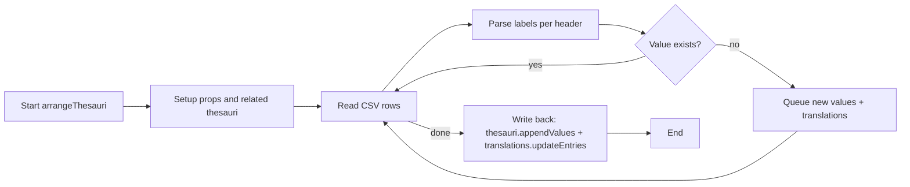
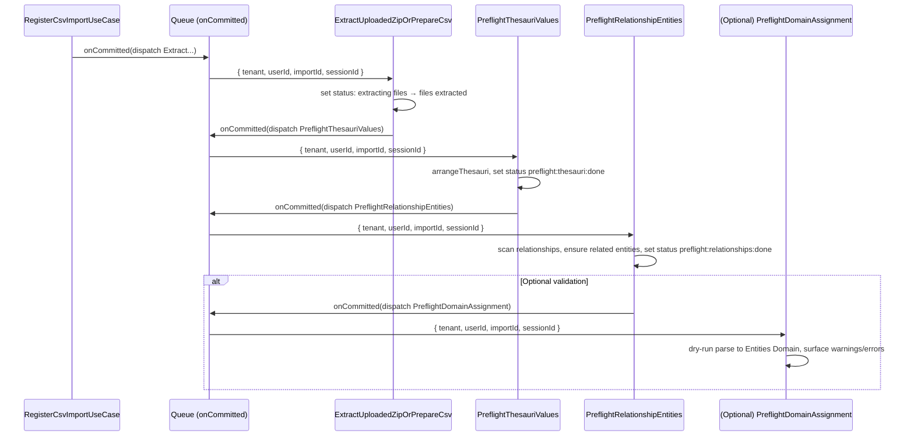

## CSV Import V2 — Context Doc 03

Date: 2025-11-17
Owner: CSV Import V2 initiative

### Purpose

Deep-dive into the legacy CSV Import (V1) flow with emphasis on its “preflight” behavior, to align how we will migrate this to V2 jobs. This document consolidates how V1 validated columns, created missing thesaurus values, and created missing related entities, and proposes the V2 preflight job breakdown and ToDos.

### Scope recap (from Context 01 and 02)

- Architecture: V2 hexagonal, job-processed stages after a quick upload response.
- Collection: `csv_imports` stores import state and metadata.
- Storage: Files.v2 under `csv-imports/{importId}`; canonical extracted CSV at `extracted/import.csv`.
- Routing: `POST /api/import`, admin-only, feature-flagged via `v2CSVImport`.
- MVP statuses so far: `queued` → `extracting files` → `files extracted`.
- Events: Job-scoped session notifications, not tenant-wide broadcasts.

### Legacy CSV Import (V1) — Preflight and Import Flow (Deep Dive)

The legacy flow is executed via the non-v2-flagged route, which directly constructs a `CSVLoader` and processes the upload immediately on the request thread:

- Entry: `app/api/csv.v2/routes/routes.ts` → `v1Import(...)` (when `v2CSVImport` is disabled) → `new CSVLoader().load(...)`.
- Core flow in `app/api/csv/csvLoader.ts`:
  - `validateColumns(...)` (headers/layout validation)
  - `arrangeThesauri(...)` (discover and create missing thesaurus values + update translations)
  - `csv(...).onRow(...)` for each row:
    - `extractEntity(...)` to split per-language row into `rawEntity` + translations
    - `importEntity(...)` to build metadata (via type parsers) and save the entity
    - `translateEntity(...)` to persist language variants and index
  - Emits event signals: progress, row exceptions, and errors

#### High-level sequence (V1)

```mermaid
flowchart TD
  A[Upload request /api/import (v1 path)] --> B[CSVLoader.load(csvPath, templateId, language and user)]
  B --> C[readResources: template, languages, defaults, dateFormat]
  C --> D[validateColumns(file, template, langs, default, newNameGeneration)]
  D --> E[arrangeThesauri(file, template, headers, languagesPerHeader, defaultLanguage)]
  E --> F[getTranslations()]
  F --> G[Stream CSV rows]
  G --> H[extractEntity(row,..., propNameToThesauriId)]
  H --> I[importEntity(rawEntity): parse to metadata]
  I --> J[relationship parser ensures related entities exist]
  J --> K[entities.save(entity, updateRelationships on, indexing off)]
  K --> L[translateEntity (per language) + indexEntities]
  L --> M[Emit: entityLoaded, progress per row]
  G -->|warns| N[Collect row-level warnings, emit rowExceptions]
  G -->|errors| O[Emit loadError; stopOnError or continue]
  M --> P[Emit: IMPORT_CSV_END]
```

#### Column validation

- File: `app/api/csv/validateColumns.ts`
- Validates header consistency:
  - No mixing language-suffixed and non-suffixed columns for the same property.
  - Only certain property types allow language-suffixed headers.
  - Language-suffixed headers must include the default language column.

#### Thesauri pre-arrangement (creates missing values)

- File: `app/api/csv/arrangeThesauri.ts`
- Inputs: CSV stream, template, headers/language info.
- Behavior:
  - Determine which template properties map to thesauri (`select`, `multiselect`).
  - For each row/header, parse labels (parent/child semantics) using normalization and fallbacks.
  - Accumulate “new” values (and children) not present in the thesaurus.
  - After scanning the entire file:
    - Append missing values into the relevant thesauri.
    - Update translations for newly added thesaurus values.
  - Throws `ArrangeThesauriError` on deterministic violations (e.g., a label used as a group header elsewhere).



#### Relationship parsing (creates missing related entities)

- File: `app/api/csv/typeParsers/relationship.ts`
- For each relationship property on the row:
  - Parse the multi-value string into unique titles.
  - Query existing entities by title (and optional template restriction).
  - For any missing titles, create new entities (with the property’s `content` template if provided).
  - Fetch the set again and return related values as `{ value: sharedId, label: title }` for metadata.

Key takeaway: V1 creates missing related entities “on the fly” during row parsing, not as a prior global preflight step.

#### Select / Multiselect parsing (maps labels to thesaurus values)

- Files: `app/api/csv/typeParsers/select.ts`, `app/api/csv/typeParsers/multiselect.ts`, `app/api/csv/typeParsers/shared.ts`
- Behaviors:
  - Normalize labels, support parent/child syntax, and handle `::` fallback form.
  - Generate metadata values by resolving thesaurus item ids; emit warnings when not found or format invalid.
  - Multiselect aggregates multiple values and surfaces parsing failures as warnings.

#### Entity creation and translations

- File: `app/api/csv/importEntity.ts`
- Steps per row:
  - Build entity metadata via type parsers (including relationship and thesauri-backed props).
  - Save entity with `{ updateRelationships: true, index: false }`.
  - Handle file/attachments if provided (store and process).
  - For translations: derive per-language variants from the row and save them; then index entities.

#### Events and errors

- Route-level events: `IMPORT_CSV_START`, `IMPORT_CSV_PROGRESS`, `IMPORT_CSV_END`, `IMPORT_CSV_ERROR`, `IMPORT_CSV_ROW_EXCEPTIONS` emitted to the request session.
- Error handling:
  - Row-level errors collected and emitted as grouped `rowExceptions` warnings after the pass.
  - `stopOnError` dictates whether processing stops at first error.

### Implications for V2 Preflight

- V1 “preflight” is split across two places:
  - Global thesauri pre-arrangement (before row processing): creates any missing thesaurus values and updates translations.
  - Per-row relationship parsing: creates missing related entities on demand.
- For V2, we should:
  - Keep “global thesauri pre-arrangement” as a dedicated job, executed after extraction and before main entity import.
  - Consider extracting relationship pre-creation into a dedicated preflight job that scans the canonical `import.csv` once and creates all missing related entities deterministically, rather than on-the-fly during entity creation.
  - Optionally add a “domain assignment/validation” preflight: build Entities Domain objects without persisting to surface structural errors earlier, improving feedback prior to heavy writes.

### Proposed V2 Job Pipeline Additions (Preflight)

- After `files extracted`:
  1. `CsvPreflightThesauriValuesUseCase` + Job
     - Reads `extracted/import.csv` and the target template.
     - Replicates V1 `arrangeThesauri` behavior with domain/DS patterns and transactions.
     - On success: set status to `preflight:thesauri:done` (or keep in `preflight` with a substage field if we add `stages` later).
     - Emits: `csvImport:preflight:thesauri:start|progress|success|error` to session.
  2. `CsvPreflightRelationshipEntitiesUseCase` + Job
     - Scans `extracted/import.csv`; for each relationship property and unique title, ensures related entities exist (using the property’s `content` template restriction).
     - Matches V1 `relationship.ts` creation semantics but as a global preflight pass for determinism.
     - On success: set status to `preflight:relationships:done`.
     - Emits: `csvImport:preflight:relationships:start|progress|success|error`.
  3. (Optional, to discuss) `CsvPreflightDomainAssignmentUseCase` + Job
     - Reads rows and attempts to build domain-level entity models without persisting, applying parsers and validations.
     - Produces a report of warnings/errors (akin to `rowExceptions`), allowing early surfacing of data issues.
     - On success: set status to `preflight:validated`; otherwise, persist a failure descriptor and set `failed` or `retrying` per policy.



### Design notes for preflight jobs (V2 patterns)

- Transactions and storage:
  - Reads from `csv-imports/{id}/extracted/import.csv`.
  - DS are transaction-aware; write updates inside `transactionManager.run(...)`.
  - Use `onCommitted` for dispatching the next job in the pipeline.
- Idempotency:
  - Jobs should tolerate re-execution. V1’s thesauri append is naturally append-only; ensure the relationship preflight checks for existence before create.
- Progress/events:
  - Emit to session only; heartbeat on row progress to renew locks.
  - Keep concise per-stage event names under `csvImport:preflight:*` prefix.
- Failure classification:
  - Deterministic policy errors → `NonRetryableJobError`, mark `failed`.
  - Transient IO/DB → propagate; job runner handles `retrying`, set status accordingly.
- Output state:
  - Persist minimal `failure` object `{ message, retryable, at, stage }` for support visibility (as affirmed in Context 02).

### Open questions / discussion

- Relationship preflight: global vs. per-row creation semantics
  - V1 creates related entities per row; a preflight that creates all up-front improves determinism and progress visibility, but we must confirm ordering constraints and template scoping for related entities.
  - Confirm whether new related entities require additional metadata beyond `title` and `template` in MVP.
- Optional domain assignment preflight scope
  - How strict should it be? Only structural checks (types/date formats/label resolution) or also cross-references?
  - Should it emit row-level warnings similar to V1’s `rowExceptions`, and block the pipeline on certain error categories?
- Event naming consistency
  - Align with `csvImport:extract:*` already used; propose `csvImport:preflight:thesauri:*`, `csvImport:preflight:relationships:*`, `csvImport:preflight:validate:*` (if added).

### ToDos (near-term, preflight)

- Define preflight statuses and (temporary) event names under `csvImport:preflight:*`.
- Implement `CsvPreflightThesauriValuesUseCase`:
  - Mirror V1 `arrangeThesauri` parsing and save behavior with domain/DS patterns and transactions.
  - Write tests: happy path, invalid formats, translation updates, idempotency.
- Implement `CsvPreflightRelationshipEntitiesUseCase`:
  - Scan canonical CSV, collect unique titles per relationship property (respecting `content` template).
  - Create any missing related entities; ensure idempotent re-runs.
  - Write tests: creation, template filtering, duplicates, retries.
- (Optional) Implement `CsvPreflightDomainAssignmentUseCase`:
  - Dry-run parse of rows into Entities Domain objects, collect warnings/errors.
  - Persist a concise report in `csv_imports.failure` or a future `errors` field; emit session events.
- Wire jobs and dispatch:
  - Register jobs, inject factories per V2 conventions, and chain via `transactionManager.onCommitted` from extraction → preflight stages.
- Event emissions:
  - Use `V1WebSocketsWrapper.emitToSession(sessionId, ...)` for `start|progress|success|error` per preflight job.
- Integration tests:
  - Real Mongo via DS factories and TM, real FS (`FileSystemStorage` + `PathManager`), and real `FileContentsIO`.
  - Use `SyncDispatcherForTests` or a `RecordingDispatcher` as appropriate to validate sequencing.

### References (V1 code pathways)

- Route to v1 flow: `app/api/csv.v2/routes/routes.ts` → `v1Import`
- Loader: `app/api/csv/csvLoader.ts`
- Columns validation: `app/api/csv/validateColumns.ts`
- Thesauri arrangement: `app/api/csv/arrangeThesauri.ts`
- Relationship parser: `app/api/csv/typeParsers/relationship.ts`
- Select/multiselect parsers: `app/api/csv/typeParsers/select.ts`, `app/api/csv/typeParsers/multiselect.ts`, `app/api/csv/typeParsers/shared.ts`
- Entity import/translation: `app/api/csv/importEntity.ts`
