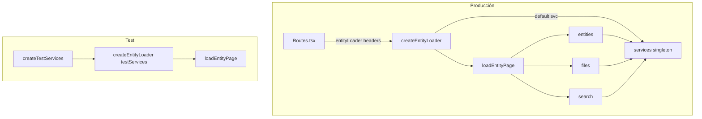
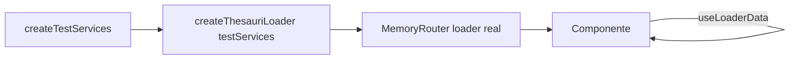

# Plan de desacoplamiento: API → Servicios en V2

> **Objetivo:** separar las rutas y componentes de V2 de las llamadas HTTP directas, introducir una capa de **Servicios** mockeable, y permitir **component testing de rutas enteras** (con loaders reales) sin red ni `jest.mock` dispersos por módulo.

**Alcance:** `app/react/V2` en uwazi-wt-second.  
**Fecha:** 2026-06-11.  
**Actualizado:** 2026-06-25 — servicios por dominio; loaders orquestan; `createXLoader`; mutaciones vía `useServices`; **SSR in-process** (§7.4).

---

## 1. Diagnóstico del estado actual

### 1.1 Estructura relevante

```
app/react/V2/
├── api/              ← capa HTTP actual (28 archivos, ~15 dominios)
├── Routes/           ← páginas + loaders + actions + lógica de orquestación mezclada
├── formatters/       ← transformaciones puras (ya desacoplado)
├── atoms/            ← estado global Jotai (settings, templates, thesauri…)
├── CustomHooks/      ← useApiCaller (casi sin uso)
└── testing/          ← TestRouterContext, TestAtomStoreProvider
```

No existe carpeta `services/`. El alias `#V2/api/*` es hoy el único punto de acceso a datos remotos.

### 1.2 Cómo consumen datos las rutas

| Patrón | Ejemplo | Problema para testing |
|--------|---------|----------------------|
| **Loader colocado en el archivo de ruta** | `Users.tsx` exporta `usersLoader` + `userAction` | Loader llama `usersAPI` directamente |
| **Loader en archivo dedicado** | `Entity/loader.ts`, `ParagraphExtraction/Loaders.ts` | Orquestación multi-API (~4–6 imports) en capa de ruta |
| **API en componentes (mutaciones)** | `Templates.tsx`, `IXSuggestions.tsx`, `EntityFilesContext.tsx` | Componente acoplado al módulo HTTP |
| **React Router action** | `userAction()` en Users, `editTranslationsAction` | **Legado** — desacoplado de API pero patrón a **eliminar** (ver §2.8) |
| **Legacy bypass** | `LanguagesList.tsx` → `I18NApi` + `useApiCaller` | Fuera de `#V2/api`, inconsistente |

**~85 archivos** bajo `Routes/` importan `#V2/api` directamente.

### 1.3 Capa `api/` actual

Funciones async por dominio (`get`, `save`, `remove`…) que envuelven `#app/utils/api.js` (JSONRequest legacy). Excepciones: `UploadService` (superagent + cola) y partes de `csv/`.

**Tres contratos de error coexisten** (bloquea abstracciones uniformes):

1. **Tupla** `ApiResponse<T, E> = [data, error?]` — `entities`, `settings`
2. **Propagación** — `thesauri` (sin try/catch)
3. **Devolver el error como valor** — `templates.get`, `search.lookup`, `users.*` hacen `catch (e) { return e }`

### 1.4 Dependencias invertidas

Dos módulos de `api/` importan tipos de rutas (dirección incorrecta):

- `api/ix/suggestions.ts` → `Routes/Settings/IX/types.ts`
- `api/paragraphExtractor/extractors.ts` → `Routes/Settings/ParagraphExtraction/types.ts`

### 1.5 Testing actual

- **73** specs bajo V2, convención `specs/` colocado.
- Patrón dominante para rutas:
  1. `jest.mock('#V2/api/...')` a nivel de módulo (12 archivos de test lo usan hoy).
  2. `TestRouterContext` inyecta `loaderData` **sin ejecutar el loader real**.
  3. `TestAtomStoreProvider` hidrata átomos Jotai.
- Excepción valiosa: `Thesauri.spec.tsx` usa `createMemoryRouter` + **loader real** con API mockeada vía `jest.mock`.
- `Entity/specs/loader.spec.ts` invoca el loader directamente con API mockeada.

**Limitación principal:** para testear una ruta con su loader hay que mockear cada path `#V2/api/X` por separado. No hay un único punto de sustitución.

### 1.6 Lo reutilizable

| Activo | Uso en el plan |
|--------|----------------|
| `formatters/` | Mantener como capa de presentación; los servicios devuelven datos ya formateados para la UI |
| `ApiResponse<T, E>` | Estandarizar como contrato de la capa HTTP |
| `UploadService` | Modelo para operaciones con estado (uploads, sockets CSV) |
| `useRequestStatus` + mutaciones en handlers | Patrón objetivo de escritura (hoy disperso; estandarizar con `useServices`) |
| `TestRouterContext` + `TestAtomStoreProvider` | Extender con inyección de servicios |
| `entityLoaderCache` | Caché de aplicación separada del HTTP |
| `useRequestStatus` / `requestStatusAtom` | Feedback de mutaciones centralizado |

---

## 2. Arquitectura objetivo

### 2.1 Cuatro capas (servicios ≠ orquestación de ruta)

```
┌─────────────────────────────────────────────────────────┐
│  Components                                             │
│  - Lectura: useLoaderData                               │
│  - Escritura: useServices() + useServiceMutation()      │
│  - NO importan api/ ni http; NO useFetcher/actions      │
└──────────────────────────┬──────────────────────────────┘
                           │
┌──────────────────────────▼──────────────────────────────┐
│  Loaders (Routes/**)                                    │
│  - Solo lectura inicial; orquestan 1..N servicios       │
│  - Helpers: loadEntityPage.ts, loaderHelper.ts          │
└──────────────────────────┬──────────────────────────────┘
                           │ llama
┌──────────────────────────▼──────────────────────────────┐
│  Services (#V2/services/) — un objeto por dominio       │
│  - Operaciones de dominio: getBySharedId, list, save…   │
│  - NO conocen loaderData ni nombres de rutas            │
│  - Implementación HTTP (cliente) o server (SSR, §7.4)   │
└──────────────────────────┬──────────────────────────────┘
                           │ usa
┌──────────────────────────▼──────────────────────────────┐
│  API (#V2/api/) → #app/utils/api.js  [solo transporte HTTP] │
│  — o — adapters server → app/api (use cases) [SSR in-process] │
└─────────────────────────────────────────────────────────┘
```

**Quién decide qué datos cargar:**

| Pieza | Decide | Ejemplo |
|-------|--------|---------|
| **Loader** | Qué servicios llamar y cómo armar `loaderData` | Entity: `entities` + `files` + `search` |
| **Servicio** | Cómo obtener un recurso de su dominio | `entities.getBySharedId()` |
| **Componente** | Cómo renderizar `useLoaderData()` | `Entity.tsx` |

Una ruta puede usar **varios servicios** en el mismo loader. Eso **no** va en un único `EntityService.loadEntityRouteData()` — la orquestación multi-dominio vive en el loader (o en un helper colocado junto a la ruta).

**Naming:**

| Capa | Responsabilidad |
|------|-----------------|
| `#V2/api/*` | HTTP 1:1 con endpoints |
| `#V2/services/*` | Fachada por dominio (`entities`, `files`, `thesauri`, …) |
| `Routes/*/loader.ts` | Factory React Router + wiring a `services` |
| `Routes/*/loadXPage.ts` | Orquestación pura (opcional, rutas complejas) |
| Mutaciones | `useServices()` / `useServiceMutation()` en componentes + `useRevalidator()` si hace falta refrescar loader |

### 2.2 Cómo acceden los loaders a los servicios

Los loaders se ejecutan **fuera del árbol React** (SSR y navegación). **No pueden usar `useServices()` ni Context.** Solo import de módulo o inyección por parámetro de factory.

#### Patrón recomendado: factory `createXLoader(services?)`

```typescript
// services/index.ts — singleton de producción
import { createDefaultServices } from './createDefaultServices.js';

export const services = createDefaultServices();
export { createDefaultServices };
export type { V2Services } from './types.js';
```

```typescript
// services/types.ts
export interface V2Services {
  entities: EntitiesService;
  files: FilesService;
  search: SearchService;
  thesauri: ThesaurusService;
  templates: TemplatesService;
  users: UsersService;
  // …
}
```

```typescript
// Routes/Settings/Thesauri/ThesauriList.tsx — ruta de un solo dominio
import { services, type V2Services } from '#V2/services/index.js';

export const createThesauriLoader =
  (svc: V2Services = services) =>
  (headers?: IncomingHttpHeaders): LoaderFunction =>
  async () => {
    const [data, error] = await svc.thesauri.list({ headers });
    if (error) throw error;
    return data;
  };

/** Lo que importa Routes.tsx — misma firma que hoy */
export const thesauriLoader = createThesauriLoader();
```

```typescript
// app/react/Routes.tsx — sin cambios de firma
loader={thesauriLoader(headers)}
// equivalente a: loader={createThesauriLoader()(headers)}
```

**Producción:** el loader importa `services` por defecto. No hay wiring manual en `Routes.tsx`.

**Tests del loader:** se pasa un `V2Services` fake a la factory — sin tocar el singleton global:

```typescript
const testServices = createTestServices({
  thesauri: { list: jest.fn().mockResolvedValue([thesauri, undefined]) },
});

const result = await createThesauriLoader(testServices)({})(
  { params: {}, request: new Request('http://test'), context: {} }
);
```

#### Rutas multi-servicio: helper de orquestación + factory

```typescript
// Routes/Entity/loadEntityPage.ts
import type { V2Services } from '#V2/services/types.js';
import type { LoaderResponse } from './types.js';

export type LoadEntityPageDeps = Pick<V2Services, 'entities' | 'files' | 'search'>;

export type LoadEntityPageInput = {
  params: { sharedId?: string; lang?: string };
  request: Request;
  headers?: IncomingHttpHeaders;
};

export async function loadEntityPage(
  deps: LoadEntityPageDeps,
  input: LoadEntityPageInput
): Promise<LoaderResponse> {
  const { entities, files, search } = deps;
  const { params, request, headers } = input;
  // … URL params, entityLoaderCache, condicionales …
  const [rows, entityError] = await entities.getBySharedId(
    { sharedId: params.sharedId!, language, omitRelationships: false },
    headers
  );
  // … files.getPagePlaintext, search.snippets según searchParams …
  return { entity, mainDocument, pagePlaintext, searchResults };
}
```

```typescript
// Routes/Entity/loader.ts
import { services } from '#V2/services/index.js';
import { loadEntityPage } from './loadEntityPage.js';

export const createEntityLoader =
  (svc: V2Services = services) =>
  (headers?: IncomingHttpHeaders): LoaderFunction =>
  async ({ params, request }) =>
    loadEntityPage(svc, { params, request, headers });

export const entityLoader = createEntityLoader();
```

El loader **compone** `entities`, `files` y `search`. Ningún servicio individual conoce el shape `LoaderResponse`.

#### Resumen: tres mecanismos de acceso

| Mecanismo | Quién lo usa | Cuándo |
|-----------|--------------|--------|
| `import { services }` + `createXLoader()` default | Loaders en producción (cliente) | Navegación en browser |
| `createServerServices(req)` + `createXLoader(serverServices)` | Loaders en SSR (`entry-server`) | Lectura inicial sin HTTP loopback (§7.4) |
| `createXLoader(testServices)` | Tests de loader, tests de ruta con loader real | Sustituir deps sin `jest.mock` de api |
| `ServicesProvider` + `useServices()` | **Solo componentes** (mutaciones en cliente) | EntityFilesContext, modales, etc. |



### 2.3 Mutaciones en componentes (patrón estándar)

**Lectura** → loader + `useLoaderData`.  
**Escritura** → componente llama servicios en el cliente. **No** React Router actions ni `useFetcher`.

```tsx
// Patrón estándar en cualquier ruta Settings / Entity
const Users = () => {
  const { users, groups } = useLoaderData();
  const { users: usersService } = useServices();
  const revalidator = useRevalidator();
  const { mutate, isPending } = useServiceMutation(usersService.deleteUser, {
    successMessage: t('System', 'User deleted', null, false),
    onSuccess: () => revalidator.revalidate(),
  });

  const handleDelete = (selected: User[]) => mutate({ users: selected, confirmation });
};
```

`useServiceMutation` (evolución de `useApiCaller`) centraliza:
- llamada al método del servicio;
- `useRequestStatus` (toast / error);
- estado `isPending` opcional.

`ServicesProvider` envuelve el árbol de la app en cliente (o solo la ruta en tests) para que `useServices()` resuelva el mismo objeto que los loaders usan por import.

### 2.4 Context para componentes (no para loaders)

```tsx
// services/ServicesProvider.tsx — solo client components
export const ServicesProvider = ({ value = services, children }) => (
  <ServicesContext.Provider value={value}>{children}</ServicesContext.Provider>
);
```

En tests de **componente** (sin loader):

```tsx
<ServicesProvider value={createTestServices({ thesauri: { deleteMany: mock } })}>
  <ThesauriList />
</ServicesProvider>
```

En tests de **ruta con loader real**, el mock va en la **factory del loader**, no en Context:

```tsx
const testServices = createTestServices({ thesauri: { list: listMock } });

render(
  <TestAtomStoreProvider initialValues={…}>
    <RouterProvider
      router={createMemoryRouter([{
        path: '/',
        element: <ThesauriList />,
        loader: createThesauriLoader(testServices)({}),  // ← aquí
      }])}
    />
  </TestAtomStoreProvider>
);
```

`ServicesProvider` no afecta al loader: React Router lo invoca antes de montar el componente.

### 2.5 Diagrama de test de ruta completa



### 2.6 Ejemplo A — ruta simple (un dominio): Thesauri

`ThesauriList` solo necesita `thesauri.list()` en el loader. Un servicio, una llamada — el loader es un wrapper fino.

#### Servicio (solo dominio thesauri)

```typescript
// services/thesauri/ThesaurusService.ts
export interface ThesaurusService {
  list(input: { headers?: IncomingHttpHeaders }): Promise<ApiResponse<ClientThesaurus[]>>;
  getById(input: { _id: string; headers?: IncomingHttpHeaders }): Promise<ApiResponse<ClientThesaurus>>;
  save(thesaurus: ThesaurusSchema): Promise<ApiResponse<ClientThesaurus>>;
  deleteMany(ids: string[]): Promise<ApiResponse<void>>;
}
```

Sin métodos con forma de ruta (`listForSettingsPage`, `enrichRows`). `enrichRows` es lógica de **vista** — vive en un helper de ruta:

```typescript
// Routes/Settings/Thesauri/buildThesauriRows.ts
export function buildThesauriRows(thesauri: ClientThesaurus[], templates: Template[]): ThesauriRow[] {
  return thesauri.map(thesaurus => ({
    ...thesaurus,
    rowId: thesaurus._id!,
    templates: templates.filter(t => t.properties?.some(p => p.content === thesaurus._id)),
    disableRowSelection: /* … */,
  }));
}
```

#### Loader con factory (acceso a servicios)

```typescript
// Routes/Settings/Thesauri/ThesauriList.tsx
import { services, type V2Services } from '#V2/services/index.js';

export const createThesauriLoader =
  (svc: V2Services = services) =>
  (headers?: IncomingHttpHeaders): LoaderFunction =>
  async () => {
    const [data, error] = await svc.thesauri.list({ headers });
    if (error) throw error;
    return data;
  };

export const thesauriLoader = createThesauriLoader();
```

```tsx
// Routes.tsx — sin cambios
loader={thesauriLoader(headers)}
```

#### Componente

```tsx
const ThesauriList = () => {
  const thesauri = useLoaderData() as ClientThesaurus[];
  const templates = useAtomValue(templatesAtom); // bootstrap SSR, no es un "servicio"
  const { thesauri: thesaurusService } = useServices();

  const currentThesauri = useMemo(
    () => buildThesauriRows(thesauri, templates),
    [thesauri, templates]
  );

  const deleteSelected = async () => {
    const [, error] = await thesaurusService.deleteMany(selectedIds);
    // … notify + revalidator
  };
};
```

#### Test del loader (inyección directa)

```typescript
const listMock = jest.fn().mockResolvedValue([thesauri, undefined]);
const testServices = createTestServices({ thesauri: { list: listMock, /* …stubs */ } });

const result = await createThesauriLoader(testServices)({})(
  { params: {}, request: new Request('http://test'), context: {} }
);

expect(listMock).toHaveBeenCalledWith({ headers: undefined });
expect(result).toEqual(thesauri);
```

#### Test de ruta entera

```typescript
const testServices = createTestServices({ thesauri: { list: listMock, deleteMany: deleteMock } });

render(
  <ServicesProvider value={testServices}>
    <TestAtomStoreProvider initialValues={[[templatesAtom, []]]}>
      <RouterProvider router={createMemoryRouter([{
        path: '/',
        element: <ThesauriList />,
        loader: createThesauriLoader(testServices)({}), // mock entra por la factory
      }])} />
    </TestAtomStoreProvider>
  </ServicesProvider>
);
```

---

### 2.7 Ejemplo B — ruta compleja (varios dominios): Entity

El loader actual ya combina `entities`, `files`, `search`, caché y query params. Eso **permanece en la capa de ruta**, no en `EntityService`.

```typescript
// services/entities/EntitiesService.ts
export interface EntitiesService {
  getBySharedId(
    input: { sharedId: string; language: string; omitRelationships?: boolean },
    headers?: IncomingHttpHeaders
  ): Promise<ApiResponse<Entity[] | undefined>>;
  // update, delete… — operaciones de entidad, no de página
}

// services/files/FilesService.ts
export interface FilesService {
  getPagePlaintext(fileId: string, page: number, headers?: IncomingHttpHeaders): Promise<string | FetchResponseError>;
}

// services/search/SearchService.ts
export interface SearchService {
  snippets(input: SnippetsInput, headers?: IncomingHttpHeaders): Promise<SnippetsSearchResponse>;
}
```

```typescript
// Routes/Entity/loadEntityPage.ts — orquestación (testeable sin React Router)
export async function loadEntityPage(
  deps: Pick<V2Services, 'entities' | 'files' | 'search'>,
  input: LoadEntityPageInput
): Promise<LoaderResponse> {
  const { entities, files, search } = deps;
  // entityLoaderCache, searchParams, getMainDocument formatter…
  const [fetched, error] = await entities.getBySharedId({ sharedId, language }, headers);
  if (error || !fetched?.[0]) return { entity: undefined, … };

  if (needsPlaintext) {
    pagePlaintext = await files.getPagePlaintext(mainDocument._id, page, headers);
  }
  if (searchTerm) {
    searchResults = await search.snippets({ sharedId, searchString: searchTerm }, headers);
  }
  return { entity, mainDocument, pagePlaintext, searchResults };
}
```

```typescript
// Routes/Entity/loader.ts
export const createEntityLoader =
  (svc: V2Services = services) =>
  (headers?: IncomingHttpHeaders): LoaderFunction =>
  async ({ params, request }) =>
    loadEntityPage(svc, { params, request, headers });

export const entityLoader = createEntityLoader();
```

#### Test del loader multi-servicio

```typescript
const entitiesMock = { getBySharedId: jest.fn().mockResolvedValue([[entity], undefined]) };
const filesMock = { getPagePlaintext: jest.fn().mockResolvedValue('page text') };
const searchMock = { snippets: jest.fn() };

const testServices = createTestServices({
  entities: entitiesMock,
  files: filesMock,
  search: searchMock,
});

await createEntityLoader(testServices)({})(
  { params: { sharedId: 'abc' }, request: new Request('http://test/en/entity/abc'), context: {} }
);

expect(entitiesMock.getBySharedId).toHaveBeenCalled();
expect(filesMock.getPagePlaintext).not.toHaveBeenCalled(); // si no hay ?page en URL
```

Cada dominio se mockea por separado — sin un mega-mock `loadEntityRouteData`.

---

### 2.8 Eliminar React Router Actions (legado Users / Translations)

Hoy solo **Users** y **EditTranslations** usan `action` + `useFetcher().submit()`. Ese patrón **no se replica** en rutas nuevas ni en la migración a servicios.

| Aspecto | Actions (legado) | Patrón estándar |
|---------|------------------|-----------------|
| Wiring | `userAction` en `Routes.tsx` + `FormData` + `intent` switch | Handler async en componente |
| Test | Difícil: simular `fetcher.submit` + action | `ServicesProvider` + mock de `usersService.deleteUser` |
| SSR mutaciones | Action corre en servidor | Mutaciones solo en cliente (aceptable en Settings admin) |
| Revalidar lista | Automático tras action | `revalidator.revalidate()` explícito tras éxito |

**Migración Users (Fase 1b o Fase 3):**

1. `UsersService` con métodos que hoy despacha `userAction` (`newUser`, `deleteUser`, `saveGroup`, …).
2. Sustituir `useFetcher` por `useServiceMutation` / `useServices()` en `Users.tsx` y sidepanels.
3. Quitar `userAction` y `action={userAction()}` de `Routes.tsx`.
4. Mantener `createUsersLoader` para lectura.

**Migración EditTranslations:** misma secuencia en PR aparte.

**Regla:** nuevas rutas V2 **no** exportan `xAction`. ESLint (fase posterior): desaconsejar `ActionFunction` en `Routes/**`.

### 2.9 `renderRoute` helper (testing)

```typescript
// testing/renderRoute.tsx
type RenderRouteOptions = {
  Component: ComponentType;
  createLoader: (svc: V2Services) => LoaderFunction; // factory, no loader ya cerrado
  services?: Partial<V2Services>;
  atomInitialValues?: Iterable<readonly [any, any]>;
  initialEntries?: string[];
};

export const renderRoute = ({
  Component,
  createLoader,
  services: overrides,
  atomInitialValues,
  initialEntries = ['/'],
}: RenderRouteOptions) => {
  const testServices = createTestServices(overrides);
  const router = createMemoryRouter([{
    path: '/',
    element: (
      <ServicesProvider value={testServices}>
        <Component />
      </ServicesProvider>
    ),
    loader: createLoader(testServices),
  }], { initialEntries });

  return render(
    <TestAtomStoreProvider initialValues={atomInitialValues}>
      <RouterProvider router={router} />
    </TestAtomStoreProvider>
  );
};

// Uso:
renderRoute({
  Component: ThesauriList,
  createLoader: svc => createThesauriLoader(svc)({}),
  services: { thesauri: { list: listMock } },
});
```

---

## 3. Normalización previa de `api/`

Antes o en paralelo con servicios, unificar la capa HTTP evita que los servicios hereden inconsistencias.

### 3.1 Contrato único

Adoptar `ApiResponse<T, E>` en **todos** los módulos `api/`:

```typescript
type ApiResponse<T, E = FetchResponseError> = [T, E?];

// Helper compartido en api/helpers.ts
export async function apiCall<T>(fn: () => Promise<T>): Promise<ApiResponse<T>> {
  try {
    return [await fn()];
  } catch (e) {
    return [undefined as T, e as FetchResponseError];
  }
}
```

Los servicios interpretan el error de forma uniforme (`if (error) throw` o `handleRouteError(error)`).

### 3.2 Extraer tipos compartidos

Mover tipos que hoy viven en rutas hacia ubicaciones neutras:

| Origen | Destino propuesto |
|--------|-------------------|
| `Routes/Settings/IX/types.ts` (solo DTOs de API) | `api/ix/types.ts` o `shared/ix/types.ts` |
| `Routes/Settings/ParagraphExtraction/types.ts` | `api/paragraphExtractor/types.ts` |

Las rutas pueden re-exportar tipos de vista si necesitan extensiones UI-only.

### 3.3 Puentes legacy

`settings`, `users`, `translations` envuelven `*API` de V1. Los servicios deben ser el **único** consumidor de esos puentes; las rutas nunca importan `#app/Settings` ni `I18NApi` directamente.

---

## 4. Diseño de servicios por dominio

### 4.1 Criterio: qué va en cada capa

| Va en **api/** | Va en **service/** | Va en **loader / helper de ruta** |
|----------------|-------------------|-----------------------------------|
| Un endpoint HTTP | Operación de un dominio (`getBySharedId`, `list`) | Componer varios servicios |
| Serialización mínima | Reutilizar `formatters/` si aplica al dominio | Shape de `loaderData` |
| Sin estado | Caché **de dominio** si se reutiliza en varias rutas | `entityLoaderCache`, condicionales por URL |
| | Sin nombres de rutas | `buildThesauriRows`, `loaderHelper.ts` |

**Regla:** si una función necesita datos de `entities` **y** `files` **y** `search`, no va en ningún servicio individual — va en `loadEntityPage.ts` o en el loader.

### 4.2 Servicios prioritarios (operaciones de dominio)

| Servicio | Origen en `api/` | Métodos (dominio, no ruta) |
|----------|------------------|----------------------------|
| `EntitiesService` | `api/entities` | `getBySharedId`, `getById`, `update`, … |
| `FilesService` | `api/files`, `UploadService` | `getPagePlaintext`, `upload`, `remove`, `update` |
| `SearchService` | `api/search` | `snippets`, `lookup` |
| `TemplatesService` | `api/templates` | `list`, `setDefault`, `remove`, `checkEntityCounts` |
| `ThesaurusService` | `api/thesauri` | `list`, `getById`, `save`, `deleteMany` |
| `UsersService` | `api/users` | `get`, `getUserGroups`, `newUser`, `saveGroup`, … |
| `IxService` | `api/ix/*` | `listSuggestions`, `acceptSuggestion`, … |
| `ParagraphExtractionService` | `api/paragraphExtractor/*` | `listExtractors`, `listEntities`, … |
| `CsvImportService` | `api/csv` | `listImports`, `upload`, eventos socket |

**Orquestación por ruta** (helpers, no servicios):

| Ruta | Helper / loader | Servicios que compone |
|------|-----------------|----------------------|
| Entity | `loadEntityPage.ts` | `entities`, `files`, `search` |
| IX Suggestions | `loaderHelper.ts` | `ix`, `templates`, `entities`, `search`, … |
| Paragraph Extraction | `Loaders.ts` | `paragraphExtractor`, `entities`, `settings`, `templates` |
| Thesauri list | `createThesauriLoader` directo | solo `thesauri` |

### 4.3 Patrón de exportación en cada ruta

Toda ruta exporta **solo loader** (lectura). Mutaciones viven en el componente vía `useServices()`.

```typescript
export const createXLoader = (svc: V2Services = services) => (headers?) => LoaderFunction;
export const xLoader = createXLoader();
```

`Routes.tsx` importa `xLoader` — no `xAction`. Las dos rutas con action legado se migran y se elimina el wiring.

---

## 5. Estrategia de testing

### 5.1 Objetivo

> Test de ruta entera = router real + loader real + componente real + **servicios mockeados en un solo sitio**.

### 5.2 Utilidades nuevas en `V2/testing/`

| Utilidad | Propósito |
|----------|-----------|
| `createTestServices(overrides)` | Factory de mocks parciales tipados (`Partial<V2Services>`) |
| `ServicesProvider` | Inyección para **componentes** en tests |
| `renderRoute({ createLoader, services })` | Router + loader factory con `testServices` inyectado |
| `fixtures/services/` | Respuestas default por dominio |

Ver implementación en §2.9.

### 5.3 Migración de tests existentes

| Test actual | Migración |
|-------------|-----------|
| `TestRouterContext` + `loaderData` fijo | Mantener para tests **solo UI** sin loader |
| `jest.mock('#V2/api/entities')` | `createTestServices({ entities: { getBySharedId: mock } })` + `createEntityLoader(testServices)` |
| `loader.spec.ts` con mock de api | Testear `loadEntityPage(testServices, input)` directamente, o `createEntityLoader(testServices)` |
| `Thesauri.spec.tsx` (loader real + mock api) | `createThesauriLoader(testServices)` en el router |

### 5.4 `useServiceMutation` (patrón estándar de escritura)

Reemplaza `useApiCaller` (Languages) y elimina la necesidad de actions/`useFetcher` (Users).

```typescript
// CustomHooks/useServiceMutation.ts
const { mutate, isPending, error } = useServiceMutation(
  (svc) => svc.templates.setDefault,
  {
    successMessage: t('System', 'Default template updated', null, false),
    onSuccess: () => revalidator.revalidate(),
  }
);

await mutate(templateId);
```

En tests del componente:

```tsx
const setDefaultMock = jest.fn().mockResolvedValue([undefined, undefined]);

render(
  <ServicesProvider value={createTestServices({ templates: { setDefault: setDefaultMock } })}>
    <Templates />
  </ServicesProvider>
);

fireEvent.click(screen.getByRole('button', { name: /set default/i }));
await waitFor(() => expect(setDefaultMock).toHaveBeenCalledWith('tpl1'));
```

Implementar en **Fase 0** junto con `ServicesProvider` — es prerequisito para migrar Users sin actions.

---

## 6. Plan de implementación por fases

### Fase 0 — Preparación (1–2 PRs, bajo riesgo)

**Objetivo:** habilitar la infra sin cambiar comportamiento.

- [ ] Crear `app/react/V2/services/` con `types.ts`, `createDefaultServices.ts`, `index.ts`
- [ ] Añadir alias `#V2/services/*` en `package.json` imports
- [ ] Implementar `ServicesProvider`, `useServices`, `useServiceMutation`, `createTestServices`, `renderRoute`
- [ ] Documentar patrón `createXLoader(svc?)` en convención de rutas
- [ ] Documentar convención en comentario JSDoc en `services/index.ts`
- [ ] Añadir `api/helpers.ts` con `apiCall` y migrar **un** módulo piloto (`entities` ya usa tuplas)

**Criterio de done:** tests existentes verdes; un test de humo que monta `ServicesProvider` con mock.

### Fase 1 — Piloto: Thesauri + Users (3–4 PRs)

**Por qué:** Thesauri tiene el mejor test de ruta con loader real y mutaciones simples en componente. Users valida loader + migración **away from actions**.

**1a — Thesauri**

- [ ] `ThesaurusService` (`list`, `getById`, `save`, `deleteMany`)
- [ ] `createThesauriLoader`; componente con `useServices` + `useServiceMutation`
- [ ] `buildThesauriRows` en helper de ruta
- [ ] Migrar `Thesauri.spec.tsx` a `createThesauriLoader(testServices)`

**1b — Users (servicios + quitar actions)**

- [ ] `UsersService` envolviendo `usersAPI`
- [ ] `createUsersLoader` para lectura
- [ ] Reescribir `Users.tsx` y sidepanels: `useServiceMutation` en lugar de `useFetcher` + `userAction`
- [ ] Eliminar `userAction` y `action={…}` en `Routes.tsx`
- [ ] Tests: mock `usersService.*` vía `ServicesProvider`

**Criterio de done:** cero `jest.mock('#V2/api/users'|'thesauri')`; cero `userAction` / `useFetcher` en Users.

### Fase 2 — Entity (3–4 PRs, alto valor)

**Por qué:** ruta más crítica; loader multi-dominio; muchos componentes hijos importan api.

- [ ] `EntitiesService`, `FilesService`, `SearchService` (operaciones de dominio)
- [ ] Extraer orquestación a `loadEntityPage.ts`; `createEntityLoader` con factory
- [ ] `entityLoaderCache` permanece en capa de ruta (o módulo `Routes/Entity/` compartido)
- [ ] `FilesService` para `EntityFilesContext` (upload/remove/update)
- [ ] Mutaciones de referencias → `useServices()` + `RelationshipsService` (dominio)
- [ ] Migrar `loader.spec.ts` → test de `loadEntityPage` con mocks por servicio
- [ ] Reducir imports directos de `#V2/api` en `Routes/Entity/**`

**Criterio de done:** `loader.ts` solo wiring; `loadEntityPage.spec.ts` mockea `entities`/`files`/`search` por separado.

### Fase 2b — SSR in-process (opcional, paralelizable tras Fase 2)

**Objetivo:** eliminar HTTP loopback en loaders SSR sin cambiar loaders ni componentes cliente.

**Prerequisito:** dominios de Fase 2 ya tienen `EntitiesService` / `FilesService` / `SearchService` con contrato estable (implementación HTTP).

- [ ] `createServerServices(req)` + `ServerServiceContext` (user, tenant, language, headers)
- [ ] `services/server/*` — adapters in-process para `entities`, `files`, `search`
- [ ] Wiring en `entry-server.tsx`: pasar `serverServices` a `getRoutes` / loaders
- [ ] Tests de paridad: mismo `req` → mismo `loaderData` (HTTP vs server)
- [ ] Métrica: latencia SSR en Entity (antes/después)

**Criterio de done:** Entity loader en SSR sin loopback para lectura; cliente sin cambios; tests de paridad verdes.

**Nota:** dominios cuyo bootstrap ya es in-process (`prepareStores`: templates, thesauri, relation types) pueden servir de plantilla. Expandir a loaders de ruta cuando el adapter HTTP del servicio exista.

### Fase 3 — Settings masivos (PRs por subdominio)

Orden sugerido por dependencias cruzadas:

1. `TemplatesService` (+ editor)
2. Servicios `paragraphExtractor` + orquestación en `Loaders.ts` (romper dependencia invertida de tipos primero)
3. Servicios `ix` + helpers `IX/loaderHelper.ts` (orquestación multi-servicio en ruta)
4. `CsvImportService` (incluye socket/events)
5. Resto: Pages, Preserve, ActivityLog, Collection, CustomUploads, Filters, Menu, Account
6. **EditTranslations** — quitar `editTranslationsAction` (último action legado)

Cada PR:
- Servicio + loader delgado + migración de tests del subdominio
- Sin mezclar subdominios en un solo PR grande

### Fase 4 — Normalización api/ + legacy (paralelizable)

- [ ] Unificar manejo de errores en todos los módulos `api/`
- [ ] Migrar `LanguagesList` a `TranslationsService` (eliminar `I18NApi` directo en ruta)
- [ ] Evaluar si `api/` se renombra internamente a `repositories/` (solo cuando todo Routes use servicios)

### Fase 5 — Componentes compartidos fuera de Routes

Algunos componentes en `V2/Components/` importan api (buscar y migrar):

- Pasan a recibir datos por props o `useServices()`
- O sus consumidores en Routes pasan callbacks del servicio

---

## 7. Convenciones y reglas de equipo

### 7.1 Imports permitidos

| Desde | Puede importar |
|-------|----------------|
| `Routes/**` | `#V2/services`, `#V2/formatters`, `#V2/Components`, `#V2/atoms`, tipos. Loaders importan `services` + exportan `createXLoader` |
| `services/http/**` | `#V2/api`, `#V2/formatters`, `#shared/*` |
| `services/server/**` | `#api/*` (use cases, factories, `v1_layer`), `#V2/formatters`, `#shared/*`. **No** controllers Express ni `#V2/Routes` |
| `services/**` (shared) | Solo tipos, `createDefaultServices`, `createServerServices`, providers |
| `api/**` | `#app/utils/api`, `#shared/*`, **nunca** `#V2/Routes` |
| `Components/**` | Evitar `#V2/api`; preferir props o `useServices()` |

### 7.2 ESLint (fase 2+)

Regla `no-restricted-imports` en `Routes/**`:

```json
{
  "paths": [{
    "name": "#V2/api",
    "message": "Import from #V2/services instead"
  }]
}
```

Aplicar primero como `warn`, luego `error` cuando Fase 3 avance.

### 7.3 SSR — headers y wiring de loaders

Los servicios reciben `headers?: IncomingHttpHeaders` en métodos usados por loaders SSR. La firma `(headers?) => LoaderFunction` se mantiene en el export de producción (`xLoader`). Internamente: `createXLoader(services)(headers)`.

En **cliente**, el singleton `services` delega en `#V2/api` (HTTP al servidor real).

En **SSR**, hoy los loaders siguen ese mismo camino: `entry-server.tsx` configura `api.APIURL('http://localhost:PORT/api/')` y cada loader hace HTTP loopback (sale del proceso Node, entra por Express, serializa JSON y vuelve). Ver §7.4 para la alternativa in-process.

### 7.4 SSR in-process — servicios que llaman al backend directamente

#### Problema

En SSR coexisten **dos patrones** (ver `app/react/entry-server.tsx`):

| Capa | Patrón actual | Ejemplo |
|------|---------------|---------|
| **Bootstrap** (`prepareStores`) | Llamada directa a `app/api/*` | `templatesApi.get()`, `thesauriApi.dictionaries()` |
| **Loaders de ruta** (React Router) | HTTP loopback vía `#V2/api` → `#app/utils/api.js` | `entityLoader`, `thesauriLoader`, etc. |

El loopback añade overhead por llamada: serialización JSON, routing Express, middleware (auth, tenant, i18n), allocación request/response. En rutas multi-servicio (p. ej. Entity: `entities` + `files` + `search`) el coste se multiplica.

#### Viabilidad

**Alta a nivel arquitectónico** — el plan ya define servicios como fachada inyectable (`createXLoader(svc?)`). La inyección no es solo para tests: también permite elegir **transporte según runtime**:

```
Loaders → Services (interfaz) → [ http (#V2/api) | server (use cases / v1_layer) | test (mocks) ]
```

**Media-alta en migración incremental** — dominio a dominio, alineado con las fases del plan.

**Media-baja en cobertura completa a corto plazo** — backend heterogéneo (legacy `app/api/*`, V2 core, `v1_layer`), auth/permisos que hoy pasan por middleware HTTP, y dominios con sockets/uploads.

Las **mutaciones en SSR no son prioridad**: el plan cierra escritura en cliente vía `useServices()` / `useServiceMutation()`. El ahorro in-process aplica sobre todo a **lecturas de loader**.

#### Tres implementaciones de servicio (mismo contrato)

```
services/
  http/       → delega en #V2/api (cliente + SSR actual)
  server/     → delega en use cases / factories / v1_layer (SSR loaders)
  testing/    → createTestServices (Fase 0)
```

Cada dominio expone la **misma interfaz** (`EntitiesService`, `ThesaurusService`, …). Solo cambia el adapter:

| Runtime | Factory | Transporte |
|---------|---------|------------|
| Browser | `createDefaultServices()` | `services/http/*` → `#V2/api` |
| SSR | `createServerServices(req)` | `services/server/*` → `app/api` (in-process) |
| Tests | `createTestServices(overrides)` | mocks parciales |

#### Wiring en `entry-server` (no en loaders ni en componentes)

```typescript
// Pseudocódigo — entry-server.tsx
const serverServices = createServerServices({
  user: req.user,
  tenant: req.get('tenant'),
  language,
  headers,
});

const routes = getRoutes(settings, userId, headers, indexComponents, serverServices);
// Cada loader: createEntityLoader(serverServices)(headers)
```

- **Cliente:** `Routes.tsx` sigue usando `createXLoader()` con singleton HTTP.
- **SSR:** `getRoutes` recibe `serverServices` y los loaders se cierran con esa instancia.
- **Componentes:** `useServices()` en cliente **nunca** usa el adapter servidor.

#### Reglas del adapter servidor

1. **Mismo DTO que `#V2/api`** — el adapter devuelve el shape que la UI espera (reutilizar `formatters/` si aplica). Sin esto hay regresiones de hidratación.
2. **No importar `Routes/**` ni controllers Express** — llamar application layer (factories, use cases, `v1_layer`) como hace `prepareStores`.
3. **`ExecutionContext`** — envolver llamadas en `runWithContext()` con `tenant` + `actor` derivados de `req.user` / `req.headers`. No reimplementar permisos en React.
4. **Los loaders no conocen el transporte** — solo llaman `svc.entities.getBySharedId(...)`.

#### Ejemplo: `ServerEntitiesService`

```typescript
// services/server/entities/ServerEntitiesService.ts
import { EntitiesQueryServiceFactory } from '#api/core/infrastructure/factories/EntitiesQueryServiceFactory.js';
import type { ServerServiceContext } from '../types.js';

const createServerEntitiesService = (ctx: ServerServiceContext): EntitiesService => ({
  getBySharedId: async ({ sharedId, language, omitRelationships }, _headers) =>
    runWithServerContext(ctx, async () => {
      const queryService = EntitiesQueryServiceFactory.default(ctx.user);
      const rows = await queryService.getEntities({
        sharedId,
        language,
        includeRelationships: !omitRelationships,
      });
      return [mapToClientEntity(rows), undefined];
    }),
  // ...
});
```

#### Orden sugerido (después de Fase 2 HTTP)

| Prioridad | Dominio | Motivo |
|-----------|---------|--------|
| Alta | `entities`, `files`, `search` | Entity loader multi-llamada; ruta crítica |
| Media | `thesauri`, `templates`, `users` | Settings; bootstrap ya llama backend directo para algunos |
| Baja | `csv`, uploads, sockets | Poco impacto en lectura SSR de loader |

#### Qué no hacer

- Que los loaders importen `app/api` directamente (rompe testabilidad y la capa de servicios).
- Big-bang que sustituya todo el loopback SSR de golpe.
- Asumir que in-process es siempre más simple — a veces el módulo legacy no es más limpio que HTTP.

#### Tests

| Tipo | Enfoque |
|------|---------|
| Loader (unit) | `createTestServices` — sin red, sin backend |
| Adapter servidor | Integración contra use cases / DB de test |
| Paridad SSR | Mismo `req` → comparar `loaderData` HTTP vs in-process |

---

## 8. Riesgos y mitigaciones

| Riesgo | Mitigación |
|--------|------------|
| PRs enormes | Un servicio / subdominio por PR; fases estrictas |
| Doble abstracción (api + service) sin valor | Servicios = fachada por dominio; orquestación multi-dominio en loaders/helpers |
| Regresiones SSR | Tests de loader con headers mock; smoke e2e en rutas piloto; tests de paridad HTTP vs in-process (§7.4) |
| Divergencia HTTP vs in-process (bugs solo en SSR) | Misma interfaz de servicio; contract tests por dominio |
| `ExecutionContext` no inicializado en adapter servidor | `runWithServerContext(ctx, fn)` en cada método server |
| `jest.mock` de módulo singleton `services` | Usar `createXLoader(testServices)` / `loadXPage(testServices, input)`; nunca espiar el singleton global |
| Uploads/sockets no encajan en CRUD | `FilesService` y `CsvImportService` encapsulan `UploadService` y `csv/events` |
| Regresión al migrar Users off actions | PR dedicado 1b; mantener comportamiento de confirmación/password en handlers |

---

## 9. Métricas de progreso

| Métrica | Hoy (aprox.) | Objetivo |
|---------|--------------|----------|
| Archivos en `Routes/` que importan `#V2/api` | ~85 | 0 |
| Specs con `jest.mock('#V2/api` | 12 | 0 (mocks vía servicios) |
| Módulos api con dependencia a Routes | 2 | 0 |
| Rutas con loader > 50 líneas de orquestación | ~8 | 0 (lógica en `loadXPage.ts`, no en servicios) |
| Tests de ruta con loader real | 2–3 | mayoría de rutas V2 |
| Rutas con React Router `action` | 2 (Users, EditTranslations) | 0 |

---

## 10. Decisiones abiertas

1. **Clases vs objetos literales** para implementaciones de servicio. Recomendación: **objetos** con funciones (estilo actual de `api/`) + interfaces TypeScript; clases solo si hay estado (como `UploadService`).

2. **Singleton `services` vs Context vs factory.** Cerrado: **singleton** como default en `createXLoader(services)`; **factory** `createXLoader(testServices)` para tests; **Context** solo para componentes en cliente (mutaciones). Los loaders no usan Context.

3. **Renombrar `api/` → `repositories/`.** Posponer a Fase 4; el alias `#V2/api` puede convivir años.

4. **React Query / SWR.** Fuera de alcance; el proyecto usa React Router loaders + Jotai. Los servicios son compatibles con una migración futura a React Query (los hooks llamarían a los mismos servicios).

5. **React Router Actions para mutaciones.** **Cerrado: no.** Users/Translations son legado. Estándar = loader (lectura) + `useServices` / `useServiceMutation` (escritura) + `useRevalidator` cuando aplique. Ver §2.8.

6. **SSR: HTTP loopback vs in-process.** **Cerrado: ambos vía inyección.** Cliente usa `createDefaultServices()` (HTTP). SSR loaders usan `createServerServices(req)` (in-process) cuando el adapter existe; fallback HTTP hasta completar migración por dominio. Ver §7.4. La inyección `createXLoader(svc?)` sirve para tests, SSR y cliente — no solo para mocks.

---

## 11. Referencias en el codebase

| Archivo | Rol |
|---------|-----|
| `app/react/entry-server.tsx` | SSR: bootstrap in-process (`prepareStores`) + loaders con loopback HTTP; destino del wiring `createServerServices` (§7.4) |
| `app/react/Routes.tsx` | Registro de rutas V2 y wiring de loaders |
| `app/react/V2/api/ApiResponse.ts` | Tipo tupla a estandarizar |
| `app/react/V2/api/entities/index.ts` | Ejemplo de contrato tupla |
| `app/react/V2/api/templates/index.ts` | Ejemplo de `return e` en catch |
| `app/react/V2/Routes/Settings/Users/Users.tsx` | Legado action — migrar a `useServiceMutation` (§2.8) |
| `app/react/V2/Routes/Settings/Translations/EditTranslations.tsx` | Legado action — migrar en Fase 3 |
| `app/react/V2/Routes/Entity/loader.ts` | Orquestación → `loadEntityPage.ts`; servicios por dominio |
| `app/react/V2/Routes/Settings/ParagraphExtraction/Loaders.ts` | Orquestación multi-API |
| `app/react/V2/Routes/Settings/Thesauri/specs/Thesauri.spec.tsx` | Test con loader real |
| `app/react/V2/testing/TestRouterContext.tsx` | Harness actual a extender |
| `app/react/V2/CustomHooks/useApiCaller.tsx` | Base para `useServiceMutation` |
| `app/react/V2/atoms/store.ts` | Hidratación SSR de datos de referencia |

---

## 12. Próximo paso inmediato

Abrir **PR Fase 0** con:

1. Estructura `services/` vacía + interfaces de `UsersService` y `ThesaurusService` (sin migrar rutas aún).
2. `createTestServices` + `ServicesProvider`.
3. Un test de ejemplo que monte `ThesauriList` con `createThesauriLoader(testServices)` y `thesauri.list` mockeado.

Eso valida el mecanismo de mocking antes de mover lógica de producción.
