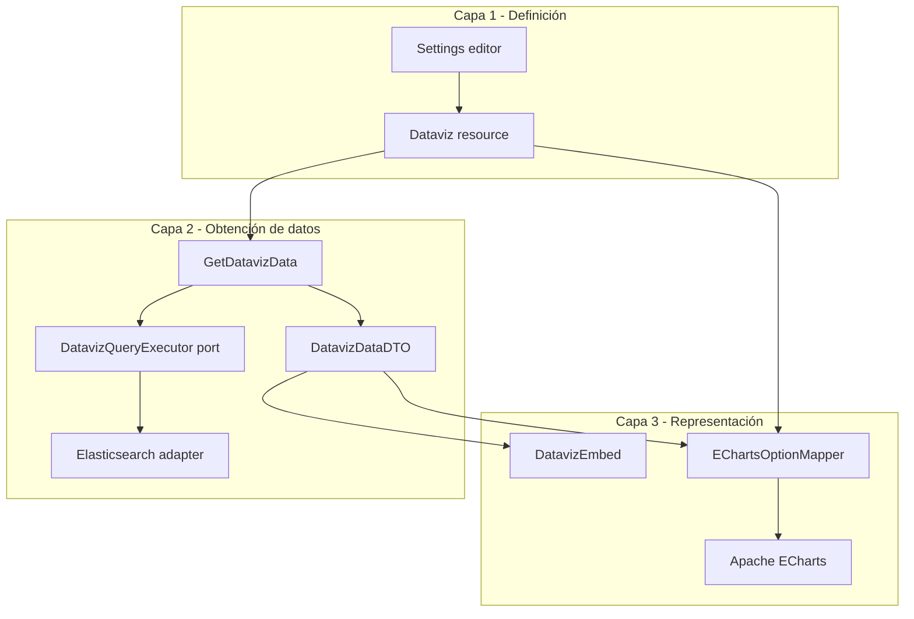

# Requerimientos: Data Visualizations (Dataviz)

Documento de requerimientos para una funcionalidad nueva en Uwazi. **No incluye implementación.**

> **Límite de alcance:** Los charts históricos embebidos en Pages (p. ej. `<BarChart>`, `<PieChart>`, datasets de página) **no forman parte de esta tarea**. Siguen existiendo y manteniéndose por su cuenta; este documento **no** exige compatibilidad, migración, conversión ni regresión sobre ellos.

> **Autoridad vs. diseño:** Este documento es la **fuente de verdad** (alcance, contratos, fases). Los mockups de UI (editor por pestañas, panel de preview, modal de data sources, etc.) son **guía de diseño**: orientan layout y copy, pero no amplían alcance ni adelantan fases salvo lo que aquí se incorpore explícitamente. Ver §17.

---

## 1. Contexto y problema

### Situación

Hoy no existe un sistema unificado para que los administradores **definan, reutilicen y embeban** visualizaciones basadas en agregaciones de entidades. La nueva funcionalidad **Dataviz** cubre ese hueco de producto de extremo a extremo (Settings → API de datos → embed en Pages).

La infraestructura subyacente (templates, propiedades, thesauri, agregaciones Elasticsearch en búsqueda/biblioteca, permisos) **sí** se reutiliza; los componentes de charts antiguos en Pages **no** son referencia de diseño ni de implementación para Dataviz.

### Objetivo del producto

Permitir que administradores/editores **definan visualizaciones reutilizables**, las **embeban** en Pages (y futuras superficies) con un tag simple, y mantengan **separación estricta** entre:

1. **Definición** (qué medir, cómo combinar, cómo pintar).
2. **Datos** (agregaciones / series normalizadas).
3. **Representación** (librería de charts, tema, interactividad).

### Principios de arquitectura

| Principio                     | Descripción                                                                                                           |
| ----------------------------- | --------------------------------------------------------------------------------------------------------------------- |
| **Tres capas**                | Definición / obtención de datos / representación — ver §4. Frontera estable: `DatavizDataDTO`. |
| **Librería de charts**        | **Apache ECharts** solo en capa de representación; mapper aislado para poder sustituir la librería. |
| **Config as source of truth** | Cada visualización es un recurso persistido (`Dataviz`) con `id` estable para embed.                                  |
| **Reuse aggregations**        | Reutilizar la lógica de agregaciones de biblioteca/search donde sea posible; no duplicar reglas de permisos/filtros.  |
| **Sensible combinations**     | Matriz explícita propiedad × tipo de chart; rechazar combinaciones inválidas en UI y API.                             |
| **Permissions-aware**         | Los datos respetan permisos de entidad igual que la biblioteca.                                                       |
| **Módulo independiente**      | Dataviz es un subsistema nuevo; no modifica ni sustituye charts históricos en Pages.                                    |

---

## 2. Glosario

| Término                | Definición                                                                              |
| ---------------------- | --------------------------------------------------------------------------------------- |
| **Dataviz**            | Recurso persistido: definición de una visualización (query + chart + estilo + refresh). |
| **Dataviz definition** | Configuración guardada (sin datos).                                                     |
| **Dataviz data**       | Respuesta del endpoint de datos: series/buckets normalizados.                           |
| **Dataset (query)**    | Conjunto de entidades + agregaciones que alimentan el chart.                            |
| **Axis / dimension**   | Campo categórico o temporal (eje X, segmentos, color).                                  |
| **Measure**            | Valor numérico agregado (conteo, suma, etc.).                                           |
| **Embed**              | `<Dataviz id="…" />` (o variantes) en Markdown/HTML de Pages.                           |
| **Snapshot**           | Datos precalculados y almacenados con timestamp.                                        |
| **Capa de definición** | Config persistida (`Dataviz`); sin datos ni opciones ECharts.                           |
| **Capa de datos**      | `GetDatavizData` + `DatavizQueryExecutor`; produce `DatavizDataDTO`.                    |
| **Capa de representación** | `EChartsOptionMapper` + ECharts; solo consume DTO + `chart` / `appearance`.         |

---

## 3. Alcance funcional

### 3.1 En alcance (MVP → v1)

- CRUD de Dataviz en Settings (solo roles autorizados).
- Endpoint de **datos** dedicado por `id`.
- Embed en **Pages** (Markdown custom element).
- Charts basados en **una o dos templates** y **1–2 dimensiones + medidas**.
- Modos de refresh: **live**, **manual**, **programado** (diario / semanal / mensual).
- Catálogo inicial de charts (ver §6); render con **ECharts** (§4.3).
- Paleta desde **template color** y **theme colors** de la colección.
- Validación de tipos de propiedad.
- Preview en el editor de Dataviz.

### 3.2 Fuera de alcance (v1, candidatos v2)

- Editor visual drag-and-drop de queries SQL-like.
- Charts en Entity view / Library sidebar (solo Pages en v1 salvo decisión explícita).
- Export PNG/PDF desde embed.
- Dashboards multi-chart con filtros globales sincronizados.
- `newRelationship` como dimensión principal (complejidad alta).
- Drill-down interactivo a entidad desde bucket (nice-to-have v1.1).
- API pública sin autenticación (salvo pages ya públicas con permisos heredados).
- **Charts históricos en Pages** (`<BarChart>`, `<PieChart>`, `<ListChart>`, `<GaugeChart>`, `<Dataset />`, `updatePageDatasets`, etc.): mantenimiento, migración, paridad visual o deprecación — **fuera de alcance de este proyecto**.
- Cualquier trabajo de regresión o E2E sobre charts antiguos en Pages.

---

## 4. Arquitectura de tres capas (imperativa)

La funcionalidad Dataviz **debe** implementarse como tres capas desacopladas. El objetivo es poder **cambiar la librería de charts** (p. ej. ECharts → otra) tocando solo representación, o **cambiar el motor de datos** (p. ej. Elasticsearch → SQL/warehouse) tocando solo obtención de datos, sin reescribir definiciones ni UI de configuración.

### 4.1 Las tres capas

| Capa | Responsabilidad | Persistencia / transporte | No debe conocer |
| ---- | --------------- | ------------------------ | --------------- |
| **1. Definición** | Qué medir, cómo combinar fuentes, tipo de chart, apariencia, política de refresh | Recurso `Dataviz` en Mongo; DTO de definición en API CRUD | Elasticsearch, buckets, ECharts `option`, series renderizadas |
| **2. Obtención de datos** | Resolver definición → ejecutar query → normalizar resultado | `GET /api/dataviz/:id/data` devuelve **`DatavizDataDTO`**; snapshots guardan el mismo DTO | ECharts, opciones de pintura, CSS de chart |
| **3. Representación** | Pintar en pantalla (editor preview, embed en Pages) | Solo en frontend: `DatavizDataDTO` + subconjunto de definición (`chart`, `appearance`) | Elasticsearch, `search.js`, forma cruda de agregaciones ES |



### 4.2 Contratos entre capas (estables)

| Frontera | Contrato | Regla |
| -------- | -------- | ----- |
| Definición ↔ Datos | `Dataviz.query` (y metadatos de refresh) entra al use case; sale `DatavizDataDTO` | El executor **no** devuelve respuestas ES crudas al cliente |
| Datos ↔ Representación | `DatavizDataDTO` + `DatavizChartConfig` + `DatavizAppearance` | El mapper a ECharts **no** lee `query` ni llama APIs de búsqueda |
| Definición ↔ Representación | Tipos `ChartType`, `pieOptions`, colores | La definición **no** almacena `EChartsOption` serializado |

`DatavizDataDTO` (§5.6) es el **único** formato de datos que consume la capa de representación. Si mañana los datos vienen de Postgres, el DTO se mantiene igual.

### 4.3 Librería de representación: Apache ECharts

**Decisión:** capa 3 usa **[Apache ECharts](https://echarts.apache.org)** vía **[echarts-for-react](https://github.com/hustcc/echarts-for-react)** (o equivalente delgado).

| Aspecto | Requisito |
| ------- | --------- |
| **Único punto de import** | Módulo `EChartsOptionMapper` (nombre orientativo) bajo `app/react/V2/Dataviz/rendering/` — **único** lugar que importa `echarts` / `echarts-for-react` |
| **Entrada del mapper** | `(data: DatavizDataDTO, chart: DatavizChartConfig, appearance: DatavizAppearance) => EChartsOption` |
| **Salida** | Componente `DatavizChartView` que recibe `option` y renderiza |
| **Tipos sin ECharts** | `list`, `metric` — componentes React propios que consumen el mismo `DatavizDataDTO` (no forzar ECharts) |
| **Tests** | Unit tests del mapper: DTO fijo → snapshot de `option` JSON; **sin** montar ECharts salvo E2E opcional |

Cambiar de librería en el futuro = sustituir mapper + `DatavizChartView`; **no** tocar definición ni `GetDatavizData`.

### 4.4 Obtención de datos: puerto + adaptador

| Pieza | Ubicación orientativa | Rol |
| ----- | --------------------- | --- |
| `DatavizQueryExecutor` | `application/contracts/` | **Puerto:** `execute(query: DatavizQuery, context): Promise<DatavizDataDTO>` |
| `ElasticsearchDatavizQueryExecutor` | `infrastructure/elasticSearch/` (o `v1_layer` bridge temporal) | **Adaptador** actual: reutiliza lógica de agregaciones de biblioteca |
| `GetDatavizData` | `application/` | Orquesta: cargar definición → validar → executor → DTO |
| Futuro `SqlDatavizQueryExecutor` | otro adaptador | Mismo puerto, mismo DTO |

**Prohibido** en capa 2: importar ECharts, devolver buckets ES al frontend, mezclar `chart.type` en la query ES.

### 4.5 Capa de definición: qué guarda y qué no

La entidad `Dataviz` (§5) agrupa:

- `query` — solo capa de datos.
- `chart`, `appearance`, `refresh` — datos para capa 3 y política que capa 2 interpreta (`refresh` no afecta forma del DTO).

La UI de Settings (§17) edita **definición**; el panel Preview llama **`/data`** y pasa el resultado al mapper ECharts — **no** calcula agregaciones en el browser.

### 4.6 Reglas de dependencia (lint / review)

| Módulo | Puede depender de |
| ------ | ----------------- |
| `domain/dataviz`, schemas `#shared` | Solo dominio / shared |
| `application/GetDatavizData`, validators | Definición + puerto executor + `DatavizDataDTO` |
| `infrastructure/.../Elasticsearch*Executor` | search/ES, templates, thesauri; **no** React, **no** echarts |
| `react/V2/Dataviz/rendering/*` | `DatavizDataDTO`, tipos chart/appearance; **no** `search.js`, **no** Mongo |
| `react/V2/Dataviz/editor/*` | API definición + API `/data` para preview; **no** import echarts fuera de `rendering/` |

### 4.7 Criterio de éxito arquitectónico

- [ ] Sustituir `ElasticsearchDatavizQueryExecutor` por un mock/fixture en tests de `GetDatavizData` sin cambiar tests del mapper ECharts.
- [ ] Sustituir `EChartsOptionMapper` por otro mapper (test doble) sin cambiar backend ni definición guardada.
- [ ] Ningún archivo en `app/api` importa `echarts`.
- [ ] Ningún archivo en `infrastructure/elasticSearch` importa componentes React.

---

## 5. Modelo de dominio (conceptual)

### 5.1 Entidad `Dataviz`

```typescript
// Conceptual — no es código a implementar ahora

Dataviz {
  id: string                    // estable para embed, ej. dv_cars_by_color
  name: string                  // nombre admin, ej. "Cars by color"
  description?: string
  status?: 'draft' | 'published' // v2 / decisión diferida; MVP editor: solo Save/Delete, embed tras guardar

  query: DatavizQuery           // QUÉ datos
  chart: DatavizChartConfig      // CÓMO pintar (presentación)
  appearance: DatavizAppearance  // colores, leyenda, labels
  refresh: DatavizRefreshPolicy

  createdAt, updatedAt, createdBy
  processing?: { active, ... }  // si hay job de snapshot
}
```

### 5.2 `DatavizQuery` — capa de definición (entrada a capa de datos)

```typescript
DatavizQuery {
  // Alcance de entidades
  sources: DatavizSource[]      // N templates (union); sin límite práctico en UI

  // Filtros opcionales (mismo modelo mental que Library, shape serializable)
  filters?: DatavizFilter[]     // ver §5.2.1
  includeUnpublished?: boolean  // default según permisos usuario

  // Agregación
  dimensions: DimensionSpec[]   // 0–2 en MVP pie/bar; hasta N en v2
  measures: MeasureSpec[]       // al menos 1 (típicamente count)

  // Combinación multi-template
  join?: {
    type: 'union' | 'relationship'  // v1: union (P1); relationship P3
    relationshipProperty?: string   // si join por relación
    relationshipTemplate?: string
  }

  language?: string             // para labels de thesaurus
  limit?: number                // top N buckets (default 50)
}
```

```typescript
DatavizSource {
  templateId: string
  alias?: string                // ej. "cars", "owners" en leyendas
}
```

```typescript
DimensionSpec {
  sourceAlias?: string          // si multi-template
  property: string              // name de propiedad
  propertyType: PropertyType    // denormalizado al guardar
  bucketStrategy?: 'terms' | 'date_histogram' | 'range'
  dateInterval?: 'day' | 'month' | 'year'
  sort?: 'count_desc' | 'label_asc' | 'key_asc'
  includeMissing?: boolean
}
```

```typescript
MeasureSpec {
  aggregation: 'count' | 'sum' | 'avg' | 'min' | 'max'
  property?: string             // requerido si sum/avg/min/max
  propertyType?: PropertyType
}
```

#### 5.2.1 `DatavizFilter` (P1)

Filtros persistidos en la definición para que el backend ejecute la query. Thesaurus y propiedades **no** almacenan color; solo valor/label.

```typescript
DatavizFilter {
  id: string
  sourceAlias?: string          // si multi-source
  property: string
  propertyType: PropertyType | 'text'
  operator: 'eq' | 'in' | 'gte' | 'lte' | 'between' | 'contains'
  value?: string | number
  values?: string[]             // in (select)
  from?: string                 // date ISO o número
  to?: string
}
```

### 5.3 `DatavizChartConfig` — capa de definición (entrada a capa de representación)

```typescript
DatavizChartConfig {
  type: ChartType               // ver catálogo §6; mapper ECharts en §4.3
  orientation?: 'horizontal' | 'vertical'
  stacked?: boolean
  showLegend?: boolean
  showLabels?: boolean
  showTooltip?: boolean
  excludeZero?: boolean
  // opciones por tipo (discriminated union); ej. pie:
  pieOptions?: {
    labelFormat?: 'value' | 'percentage' | 'both'  // guía UI: Percentage
    maxSlices?: number                              // guía UI: 10 → agrupar resto en "Other"
    othersLabel?: string                            // guía UI: "Other"
  }
  // bar, line, etc.: definir en v1.1 según catálogo
}
```

### 5.4 `DatavizAppearance`

```typescript
DatavizAppearance {
  // default: from_data — usa DataPoint.color del DTO (backend asigna paleta por bucket key)
  colorMode: 'from_data' | 'theme' | 'template' | 'custom'
  valueColorMap?: Record<string, string>  // bucket key → hex; solo en custom (override editorial)
  templateColorSource?: string  // contexto template mode (dimensión por templateId)
  labelMaxLength?: number
  emptyStateMessage?: string
  themeColors?: { background?: string; foreground?: string }
  // Precedencia en mapper: custom map > from_data (DTO) > template (por templateId) > theme palette
  // Thesaurus solo tiene texto; NO inferir color desde thesaurus en el editor
  // v2 (guía UI muestra tipografía; no bloquear MVP):
  typography?: { font?: string; size?: 'small' | 'medium' | 'large' }
}
```

### 5.5 `DatavizRefreshPolicy`

```typescript
DatavizRefreshPolicy {
  // Tres opciones en UI (guía); un solo campo resuelve el modo:
  refreshMode: 'live' | 'snapshot_manual' | 'snapshot_scheduled'

  // Si snapshot_scheduled:
  schedule?: 'daily' | 'weekly' | 'monthly'
  scheduleTime?: string         // HH:mm en cronTimezone, ej. "02:00"
  cronTimezone?: string         // ej. UTC; guía UI: selector timezone

  // Metadatos (solo lectura en API / panel Details):
  lastRefreshedAt?: ISO8601
  nextScheduledAt?: ISO8601
}
```

### 5.6 `DatavizDataDTO` — contrato de la capa de datos (salida)

**Contrato estable** entre capa 2 y capa 3 — **sin** tipos de ECharts ni estructuras ES:

```typescript
DatavizDataDTO {
  datavizId: string
  generatedAt: ISO8601
  stale: boolean                // true si snapshot antiguo / processing
  meta: {
    totalEntities: number
    truncated: boolean
    appliedFilters: ...
  }
  series: DataSeries[]
}

DataSeries {
  id: string
  label: string
  points: DataPoint[]
}

DataPoint {
  key: string | number          // bucket key
  label: string                 // human-readable (thesaurus label, fecha formateada)
  value: number
  // opcional multi-measure:
  values?: Record<string, number>
  // opcional 2ª dimensión:
  breakdown?: DataPoint[]
}
```

Ni el frontend ni el mapper ECharts deben parsear buckets crudos de Elasticsearch.

---

## 6. Catálogo de charts (v1)

**Render:** Apache ECharts (§4.3). Cada `ChartType` tiene un mapper dedicado `DatavizDataDTO` → `EChartsOption`; tipos `list` y `metric` usan UI React fuera de ECharts.

| ChartType        | Uso                     | Dimensiones     | Medidas         | Propiedades típicas               |
| ---------------- | ----------------------- | --------------- | --------------- | --------------------------------- |
| `pie`            | Distribución categórica | 1 cat           | count           | select, multiselect, template     |
| `donut`          | Igual pie               | 1 cat           | count           | idem                              |
| `bar`            | Comparación categorías  | 1 cat           | count, sum      | select, numeric, date (histogram) |
| `horizontal_bar` | Muchas categorías       | 1 cat           | count           | idem                              |
| `stacked_bar`    | 2 dimensiones (P1 editor) | 2× cat        | count           | ej. país × sexo; DTO con `breakdown` |
| `line`           | Evolución temporal      | 1 date          | count, sum      | date, multidate                   |
| `area`           | Igual line              | 1 date          | count           | date                              |
| `list`           | Ranking textual         | 1 cat           | count           | select                            |
| `gauge`          | Progreso / % de total   | 0–1 cat         | count, %        | select binario o número           |
| `metric`         | KPI grande              | 0               | count, sum, avg | numeric, count global             |
| `scatter`        | Dispersión              | 2 num/date      | —               | numeric × numeric (v1.1)          |
| `heatmap`        | Matriz 2D               | 2 cat           | count           | v2                                |
| `treemap`        | Jerarquía thesaurus     | 1 nested/select | count           | v2                                |

### Propiedades **excluidas** (no ofrecer en UI ni aceptar en API)

| Tipo                              | Motivo                                                                                    |
| --------------------------------- | ----------------------------------------------------------------------------------------- |
| `text`, `markdown`                | No agregables de forma útil                                                               |
| `media`, `image`, `preview`       | Binarios / referencias                                                                    |
| `link`                            | URL libre                                                                                 |
| `geolocation`                     | Requiere mapa, no chart estándar v1                                                       |
| `generatedid`                     | Identificadores, no analítica                                                             |
| `nested`                          | v2 (caso CEJIL)                                                                           |
| `relationship`, `newRelationship` | v1 solo como **join**, no como dimensión directa salvo conteo por tipo de relación (v1.1) |

### Propiedades **permitidas**

| Tipo                                               | Roles en query                                          |
| -------------------------------------------------- | ------------------------------------------------------- |
| `select`, `multiselect`                            | Dimensión (terms)                                       |
| `numeric`                                          | Medida (sum/avg/min/max), dimensión por rango (v1.1)    |
| `date`, `daterange`, `multidate`, `multidaterange` | Dimensión temporal (histogram)                          |
| Common: `creationDate`, `editDate`                 | Dimensión temporal                                      |
| Template id (meta)                                 | Dimensión “por tipo de entidad” en multi-template union |

### Matriz de validación (ejemplo)

Al guardar Dataviz, el backend valida:

```
validate(dimension.propertyType, chart.type, measure.aggregation) → OK | Error con mensaje i18n
```

**Ejemplo válido:** Template Cars + `colors` (select) + `pie` + measure `count`.

**Ejemplo inválido:** `description` (text) + `pie` → `PROPERTY_TYPE_NOT_SUPPORTED`.

---

## 7. Combinaciones multi-template y multi-eje

### 7.1 Una template (caso base)

> Template **Cars** → dimensión **colors** (select) → **Pie chart** → conteo por valor de thesaurus.

### 7.2 Union de dos templates (v1)

> Template **Cars** (dimensión `brand`) + Template **Motorcycles** (dimensión `brand`) → **Bar chart** apilado o agrupado con `alias` en leyenda.

- Misma propiedad **por nombre** no es obligatoria; se usa **label** o mapping explícito en v2.
- v1: requiere que la dimensión tenga **mismo tipo** y semántica compatible (UI advierte si labels difieren).

### 7.3 Join por relación (v1.1)

> Template **Cars** relacionada con **Owners** vía propiedad `owner` → dimensión en Owners `country` → conteo de Cars por país del owner.

- Usa agregaciones existentes de relación / denormalización donde aplique.

### 7.4 Dos ejes (v1)

> Dimensión X: `year` (date histogram) + Dimensión series: `color` (select) → **Stacked bar** o **multi-line**.

### 7.5 Límites v1 (explícitos)

| Límite                | Valor sugerido          |
| --------------------- | ----------------------- |
| Templates por Dataviz | sin límite en UI (validación backend) |
| Dimensiones           | 2                       |
| Medidas               | 2                       |
| Buckets por dimensión | 50 (configurable admin) |
| Timeout query live    | 30s                     |

---

## 8. Modos de actualización de datos

La pestaña **Refresh** en el editor (guía UI) expone **tres modos** mapeados a `refreshMode`:

| Modo en UI              | `refreshMode`           | Comportamiento                                                                     |
| ----------------------- | ----------------------- | ---------------------------------------------------------------------------------- |
| **Live**                | `live`                  | Cada mount del embed (y refresh manual) llama `GET /api/dataviz/:id/data`          |
| **Snapshot (manual)**   | `snapshot_manual`       | Solo `POST …/refresh` o botón “Refresh now”; sin cron                             |
| **Snapshot (scheduled)**| `snapshot_scheduled`    | Cron tenant: daily / weekly / monthly + hora + timezone                            |

| Cuándo usar | Modo recomendado        |
| ----------- | ----------------------- |
| Colecciones pequeñas, dashboards en vivo | `live` |
| Colecciones grandes, control explícito   | `snapshot_manual` |
| Informes estáticos, landing pages        | `snapshot_scheduled` |

### 8.1 Restricciones del modo Live

El modo `live` ejecuta la query en cada mount del embed. Debe **deshabilitarse** cuando el coste es alto. La UI del editor (`RefreshTab`) aplica estas reglas en cliente; el **backend debe validarlas al guardar** (pendiente).

**Umbrales** (constantes compartidas con `app/react/V2/Dataviz/utils/refreshModeConstraints.ts`):

| Constante | Valor | Uso |
| --------- | ----- | --- |
| `REFRESH_LIVE_MAX_ENTITIES` | `10_000` | Máximo de entidades en el alcance de la query |
| `REFRESH_LIVE_SLOW_QUERY_MS` | `10_000` | Duración de query que bloquea Live |
| `REFRESH_LIVE_TIMEOUT_MS` | `30_000` | Timeout documentado (§7.5) |

**Reglas estructurales** (evaluables sin ejecutar la query):

| Código | Condición en `DatavizQuery` | UI |
| ------ | -------------------------- | -- |
| `RELATIONSHIP_JOIN` | `join.type === 'relationship'` | Live deshabilitado |
| `MULTI_SOURCE` | `sources.length > 1` | Live deshabilitado |
| `MULTI_DIMENSION` | `dimensions.length >= 2` | Live deshabilitado |

**Reglas empíricas** (tras preview o última ejecución en `GetDatavizData`):

| Código | Condición | UI |
| ------ | --------- | -- |
| `HIGH_ENTITY_COUNT` | `meta.totalEntities > REFRESH_LIVE_MAX_ENTITIES` | Live deshabilitado |
| `TRUNCATED_RESULTS` | `meta.truncated === true` | Live deshabilitado |
| `SLOW_QUERY` | `meta.queryDurationMs` o duración de preview ≥ `REFRESH_LIVE_SLOW_QUERY_MS` | Live deshabilitado |
| `QUERY_TIMEOUT` | Error `DATAVIZ_QUERY_TIMEOUT` o mensaje con “timeout” | Live deshabilitado |

**Comportamiento UI (implementado):**

- `getRefreshModeConstraints(query, previewMeta?, previewError?, previewQueryDurationMs?)` → `{ liveAllowed, reasons[], messages[] }`.
- `RefreshTab`: radio **Live** con `disabled` + lista de motivos cuando `liveAllowed === false`.
- Si el usuario tenía `live` y deja de estar permitido → auto-switch a `snapshot_manual` (`useLiveRefreshGuard`).
- El **preview del editor** sigue ejecutando la query aunque Live esté deshabilitado (preview ≠ política de embed).

**Validación backend (pendiente):**

```typescript
// SaveDataviz / UpdateDataviz — rechazar si:
if (definition.refresh.refreshMode === 'live' && !liveAllowedForQuery(definition.query, lastExecutionMeta)) {
  throw new DatavizError('DATAVIZ_LIVE_NOT_ALLOWED', { reasons: [...] });
}
```

- `liveAllowedForQuery` debe replicar las reglas estructurales siempre.
- Reglas empíricas: usar `meta` de la última ejecución exitosa o ejecutar una estimación de conteo antes de aceptar `live`.
- Si un Dataviz guardado como `live` pasa a ser costoso (crecimiento de colección), `GetDatavizData` **no debe romper el embed** — servir snapshot si existe o ejecutar una vez y marcar `stale` con recomendación de migrar a snapshot.

### Requisitos transversales

- Indicador UI: “Datos de hace X minutos” cuando `stale` o snapshot.
- Botón **Refresh now** en embed (si permisos) y en editor.
- Durante `processing.active`, embed muestra skeleton + mensaje (patrón templates).
- Invalidación: cambio de template/property **no** rompe Dataviz silenciosamente → estado `broken` con razón (`PROPERTY_DELETED`, `TEMPLATE_DELETED`).

---

## 9. Embed y consumo

### 9.1 Tag propuesto

```html
<Dataviz id="ak98sd9as8d9" />
```

Atributos opcionales v1.1:

| Atributo  | Efecto                                       |
| --------- | -------------------------------------------- |
| `height`  | Altura contenedor                            |
| `locale`  | Override idioma labels                       |
| `theme`   | `light` / `dark` si pages soporta            |
| `refresh` | `live` override puntual (solo admin preview) |

### 9.2 Registro en Markdown

- Registrar `<Dataviz />` como custom element en el pipeline Markdown de Pages (mecanismo existente de componentes embebidos; **sin** tocar ni reutilizar componentes de charts históricos).
- Componente `DatavizEmbed`: `fetch(/data)` → `EChartsOptionMapper` → ECharts (§4.3).

### 9.3 Permisos en embed

- Usuario anónimo en page pública: datos agregados **sin** filtrar entidades que no puede ver (misma regla que library).
- No exponer PII en tooltips más allá de labels ya visibles en biblioteca.

### 9.4 Otras superficies (backlog)

- Entity custom pages (`entityViewPage`).
- Settings home / Collection dashboard.
- Informes PDF.

---

## 10. API Backend (requerimientos)

### 10.1 Endpoints

| Método   | Ruta                       | Descripción                        | Auth               |
| -------- | -------------------------- | ---------------------------------- | ------------------ |
| `GET`    | `/api/dataviz`             | Listar definiciones                | admin / editor     |
| `POST`   | `/api/dataviz`             | Crear                              | admin              |
| `GET`    | `/api/dataviz/:id`         | Obtener definición                 | admin / editor     |
| `PUT`    | `/api/dataviz/:id`         | Actualizar definición              | admin              |
| `DELETE` | `/api/dataviz/:id`         | Borrar                             | admin              |
| `GET`    | `/api/dataviz/:id/data`    | **Solo datos** (DTO §5.6)          | según page/context |
| `POST`   | `/api/dataviz/:id/refresh` | Forzar snapshot                    | admin              |
| `GET`    | `/api/dataviz/:id/preview` | Preview con query draft (opcional) | admin              |

### 10.2 Módulo backend — alineado a §4 (solo capas 1 y 2)

```
app/api/core/
  domain/dataviz/                    # Capa 1 — definición
    Dataviz.ts
    DatavizQuery.ts
    ChartType.ts
    validators/
  application/
    contracts/
      DatavizQueryExecutor.ts        # Puerto capa 2
    CreateDataviz.ts                 # Capa 1 CRUD
    UpdateDataviz.ts
    GetDatavizData.ts                # Capa 2 — orquesta executor → DatavizDataDTO
    RefreshDatavizSnapshot.ts
  infrastructure/
    mongodb/dataviz/                 # Persistencia definición + snapshots (DTO)
    elasticSearch/
      ElasticsearchDatavizQueryExecutor.ts  # Adaptador ES (sustituible)
    jobs/DatavizScheduledRefreshJob.ts
    express/dataviz/                 # HTTP: definición vs /data separados
```

**No** existe código ECharts ni `EChartsOption` en `app/api`.

### 10.3 `GetDatavizData` — responsabilidades (solo capa 2)

1. Cargar **definición** + validar no `broken`.
2. Invocar `DatavizQueryExecutor.execute(dataviz.query, context)`.
3. El adaptador ES (hoy) resuelve templates/thesauri, filtros, agregaciones, permisos.
4. El adaptador **normaliza** a `DatavizDataDTO` (§5.6) — nunca buckets ES al cliente.
5. Si `refreshMode` es snapshot y cache válido → devolver snapshot; si `live` → ejecutar executor.

### 10.4 Persistencia snapshot

Colección `dataviz_snapshots` o campo embebido:

```typescript
{
  datavizId,
  payload: DatavizDataDTO,
  generatedAt,
  expiresAt,
  queryHash  // invalidar si definition cambia
}
```

### 10.5 Jobs

- `DatavizRefreshJob` — uno por id o batch por tenant.
- Scheduler: integrar con sistema de jobs existente (mismo patrón `TemplatePostProcess`).
- Rate limit por tenant (evitar N charts × daily = carga ES).

### 10.6 Errores estándar

| Código                  | Situación                            |
| ----------------------- | ------------------------------------ |
| `DATAVIZ_NOT_FOUND`     | id inválido                          |
| `DATAVIZ_INVALID_QUERY` | combinación propiedad/chart inválida |
| `DATAVIZ_BROKEN`        | template/property eliminado          |
| `DATAVIZ_PROCESSING`    | snapshot en curso                    |
| `DATAVIZ_QUERY_TIMEOUT` | ES lento                             |

---

## 11. Requisitos no funcionales

| Área               | Requisito                                                                       |
| ------------------ | ------------------------------------------------------------------------------- |
| **Performance**    | Snapshot para queries > N entidades (umbral configurable, ej. 10k)              |
| **Seguridad**      | Solo admin crea/edita definiciones; datos respetan `permissionsContext`         |
| **i18n**           | Labels de thesaurus según idioma del request; traducciones de nombre Dataviz    |
| **Accesibilidad**  | Charts con texto alternativo / tabla de datos oculta para screen readers (v1.1) |
| **Observabilidad** | Log duración query, cache hit/miss                                              |
| **Migraciones DB** | Schema de colecciones Dataviz backward-compatible; snapshots regenerables       |

---

## 12. Bloques de trabajo

### Bloque A — Diseño de UI

#### A.1 Discovery e información arquitectura

- [ ] User flows: crear, previsualizar, embeber, refrescar.
- [ ] Decidir ubicación en Settings: **“Data visualizations”** (nuevo ítem menú).

#### A.2 Lista de Dataviz

- [ ] Tabla: nombre, chart type, templates, refresh mode, last updated, estado (ok / broken / processing).
- [ ] Acciones: editar, duplicar, eliminar, refresh manual, copiar embed snippet.
- [ ] Empty state + CTA “Create visualization”.

#### A.3 Editor de Dataviz (layout según guía UI)

**Layout v1 (requerido):** cabecera (nombre, badge estado, Delete / Preview / Save) + **columna izquierda** (pestañas de configuración) + **columna derecha** (preview + metadata). No es obligatorio un paso wizard lineal; las pestañas son la navegación principal.

| Pestaña        | Contenido (requerido)                                                                 |
| -------------- | ------------------------------------------------------------------------------------- |
| **Basic**      | Nombre, descripción corta                                                             |
| **Data**       | Fuentes, join, filtros, **Dimension**, **Measure** (ver §17)                          |
| **Chart**      | Tipo (selector filtrado), opciones de chart (leyenda, tooltip, labels, pieOptions…)   |
| **Appearance** | `colorMode`, paleta template/custom, `themeColors` (v1); tipografía (v2)              |
| **Refresh**    | Tres modos §8 + schedule si aplica                                                    |

**Panel derecho (requerido en v1):**

- **Preview** en vivo (misma fuente que `/data` o `/preview`).
- **Embed in Pages:** snippet `<Dataviz id="…" />` + “Copy snippet” (no pestaña Embed separada).
- **Details:** id, chart type, templates, refresh mode, bucket count, last updated, enlace “View data (JSON)” (admin).
- **Status:** OK / stale / broken / processing (ver §8).

MVP editor: cabecera con **Save** y **Delete** únicamente; embed snippet visible tras guardar. `status` draft/published diferido a v2.

#### A.4 Componentes de selección de datos

- [ ] **Template picker** (uno o dos en v1; modal “Add data source” con búsqueda + alias — guía UI).
- [ ] **Join type:** Union (v1 P2); Relationship (§7.3, **P3** — puede aparecer en guía UI deshabilitado hasta entonces).
- [ ] **Property picker** filtrado por tipo permitido + badge de tipo (ej. “Select”).
- [ ] **Dimension:** property, bucket strategy, sort, include missing.
- [ ] **Measure:** aggregation (count / sum / …), count mode si aplica (guía: “Count entities” / “Count all entities”).
- [ ] **Supported chart types** — callout dinámico según matriz §6 (guía: “Supported chart types for this configuration: Pie, Donut…”).
- [ ] **Chart picker** (pestaña Chart) — solo tipos permitidos por el callout; resto deshabilitado con tooltip.
- [ ] **Filter builder** — reutilizar `FiltersFromProperties` / V2 equivalente.
- [ ] **Preview panel** (columna derecha) — chart + tabla leyenda (color / count / %) cuando el tipo lo soporte.

#### A.5 Estados y feedback

- [ ] Loading / error / empty / broken states en editor y embed.
- [ ] Confirmación al cambiar query con snapshot existente (“se invalidará cache”).
- [ ] Advertencias: muchos buckets, query lenta, propiedades con distinto label entre templates.

#### A.6 Embed en Page editor

- [ ] Inserción desde paleta Markdown (“Insert data visualization”).
- [ ] Modal buscar Dataviz por nombre.
- [ ] Preview thumbnail en editor si es posible.

#### A.7 Design system

- [ ] Tokens: usar `template.color`, theme colors V2.
- [ ] Specs responsive: altura mínima, mobile (leyenda abajo).
- [ ] Dark mode si aplica en Pages.

#### A.8 Entregables diseño

- Figma: lista, editor, embed, estados.
- Matriz propiedad × chart (referencia para dev).
- Copy/i18n keys list.

---

### Bloque B — Backend

#### B.1 Dominio y contratos

- [ ] Modelo `Dataviz`, value objects `DatavizQuery`, `ChartType`, validators.
- [ ] JSON Schema / Zod DTOs compartidos en `#shared` (`datavizSchema.ts`).
- [ ] `DatavizDataDTO` estable documentado.

#### B.2 Persistencia

- [ ] `Dataviz` MongoDB + índices (`tenant`, `name`).
- [ ] Snapshots collection + `queryHash` invalidation.
- [ ] Job de migración DB: colección inicial vacía (solo esquema Dataviz).

#### B.3 Capa de agregación (core)

- [ ] `DatavizQueryExecutor` — adaptador sobre search/ES.
- [ ] Normalizador buckets → `DataSeries` (thesaurus labels, dates, missing).
- [ ] Soporte 1 template, 1 dimensión, count (MVP interno).
- [ ] Extender: 2 dims, stacked, sum numeric, date histogram.
- [ ] Multi-template union.
- [ ] Join por relación (v1.1).

#### B.4 Use cases

- [ ] `CreateDataviz`, `UpdateDataviz`, `DeleteDataviz`, `ListDataviz`.
- [ ] `GetDatavizDefinition`, `GetDatavizData`.
- [ ] `RefreshDatavizSnapshot`.
- [ ] Validación matriz tipos al create/update.

#### B.5 HTTP / permisos

- [ ] Controllers Express V2 + factories.
- [ ] Permisos: admin write; read data según contexto usuario.
- [ ] Tests integración: pie por select, permisos, snapshot vs live.

#### B.6 Jobs y scheduling

- [ ] `DatavizScheduledRefreshJob`.
- [ ] Registrar cron daily/weekly/monthly por tenant.
- [ ] Manual refresh endpoint + `processing` flag.

#### B.7 Integración Pages (backend)

- [ ] Validar que `id` en embed existe y tenant coincide.
- [ ] Opcional: endpoint público reducido para pages públicas.

---

### Bloque C — Frontend

#### C.1 Infraestructura

- [ ] API client `#V2/api/dataviz` — `getDefinition`, `getData` (capas separadas).
- [ ] Types desde `#shared` (`DatavizDataDTO`, definición).
- [ ] Ruta Settings `/settings/dataviz` + loader.
- [ ] Carpetas: `V2/Dataviz/editor/` (definición), `V2/Dataviz/rendering/` (solo ECharts), `V2/Dataviz/embed/`.

#### C.2 Settings UI

- [ ] `DatavizList` (tabla).
- [ ] `DatavizEditor` (wizard §A.3).
- [ ] Integración property/template pickers con `templatesAtom`, thesauri.

#### C.3 Capa de presentación (charts)

- [ ] `app/react/V2/Dataviz/rendering/` — **única** carpeta que importa ECharts (§4.3).
- [ ] `EChartsOptionMapper` por `ChartType`: entrada `DatavizDataDTO` + `chart` + `appearance`.
- [ ] `DatavizChartView` — `echarts-for-react` con `option` generado por mapper.
- [ ] Tipos v1: pie, donut, bar, horizontal_bar, line (+ `list` / `metric` como React puro).
- [ ] `colorResolver` → colores en `EChartsOption` (template / theme / custom).

#### C.4 Embed

- [ ] `DatavizEmbed` component.
- [ ] Registro en Markdown (`Markdown` registry).
- [ ] Fetch: `GET …/data` on mount; polling opcional si live + tab visible.
- [ ] Botón refresh + timestamp “Actualizado hace…”.

#### C.5 Preview

- [ ] Preview en editor contra `/preview` o `/data` con draft.
- [ ] Debounce al cambiar query.

#### C.6 Estados

- [ ] Skeleton, error, broken, empty.
- [ ] i18n todas las cadenas.

#### C.7 Tests

- [ ] Unit: `EChartsOptionMapper` — DTO fixture → snapshot JSON de `option` (sin red).
- [ ] Integration: crear Dataviz → embed en page → snapshot visual (Playwright).
- [ ] Contract test `DatavizDataDTO`.

---

## 13. Fases de entrega sugeridas

| Fase           | Contenido                                                                  | Criterio de éxito                           |
| -------------- | -------------------------------------------------------------------------- | ------------------------------------------- |
| **P0 — Spike** | Executor 1 template + 1 select + pie + endpoint data + embed mínimo        | Pie “Cars by color” en page                 |
| **P1 — MVP**   | §4 tres capas + ECharts mapper; editor §17; CRUD; live; pie + bar/list | Caso “Cars by color” publicado y embebido |
| **P2**         | Snapshot + manual + scheduled, bar/line stacked                            | Landing page con refresh semanal            |
| **P3**         | Join relación, más charts, accesibilidad, filtros avanzados                | Casos multi-template y catálogo ampliado    |

---

## 14. Criterios de aceptación (ejemplos Gherkin)

### CA-1 — Pie simple

```gherkin
Dado un template "Cars" con propiedad select "colors"
Cuando creo un Dataviz pie con dimensión colors y modo live
Y embebo <Dataviz id="X"/> en una Page
Entonces veo un pie chart con un segmento por valor de thesaurus
Y los labels están en el idioma de la página
```

### CA-2 — Propiedad excluida

```gherkin
Cuando intento seleccionar propiedad "description" tipo markdown como dimensión
Entonces el picker no la muestra
Y si envío la definición por API recibo DATAVIZ_INVALID_QUERY
```

### CA-3 — Snapshot programado

```gherkin
Dado un Dataviz con refreshMode snapshot_scheduled y schedule weekly
Cuando corre el job del tenant
Entonces se actualiza snapshot y lastRefreshedAt
Y el embed muestra datos sin ejecutar ES en cada visita
```

### CA-5 — Editor y embed snippet (guía UI)

```gherkin
Dado un Dataviz publicado con id dv_cars_by_color
Cuando abro el editor en Settings
Entonces veo preview en el panel derecho y el snippet <Dataviz id="dv_cars_by_color" />
Y al copiar el snippet puedo pegarlo en una Page
```

### CA-4 — Permisos

```gherkin
Dado un usuario sin acceso a entidades unpublished
Cuando carga el embed en page privada
Entonces los conteos no incluyen entidades no permitidas
```

### CA-6 — Separación de capas

```gherkin
Dado un DatavizDataDTO fixture cargado desde JSON
Cuando ejecuto EChartsOptionMapper con definición chart/appearance
Entonces obtengo un EChartsOption válido sin llamar a /api/dataviz ni a Elasticsearch
```

---

## 15. Decisiones abiertas (para producto)

1. ¿Quién puede **crear** Dataviz? ¿Solo admin o también editors?
2. ¿Embeds en pages **públicas** muestran datos agregados sin login?
3. ~~¿Umbral automático live → forzar snapshot?~~ **Cerrado:** reglas en §8.1; UI deshabilita Live; backend pendiente.
4. ~~¿Librería de charts?~~ **Cerrado:** ECharts en capa 3 (§4.3); contrato `DatavizDataDTO` inmutable.
5. ¿Un Dataviz puede referenciar propiedades de **templates synced**?
6. ¿Límite de Dataviz por tenant?
7. ~~¿Embed en Pages solo con `status: published`?~~ **MVP:** embed tras guardar; publish diferido v2.
8. Dependencias npm: `echarts` + `echarts-for-react` — versiones fijadas en `package.json`.

---

## 16. Resumen ejecutivo

La funcionalidad introduce **recursos Dataviz persistidos** con **tres capas imperativas** (§4): **definición** (Mongo + Settings), **obtención de datos** (`DatavizQueryExecutor` → `DatavizDataDTO`, hoy vía Elasticsearch), **representación** (mapper → **Apache ECharts**). Cambiar ES o cambiar librería de charts debe acotarse a un adaptador o al mapper, respectivamente. Embed: `<Dataviz id="…"/>`. **No** incluye charts históricos de Pages.

---

## 17. Guía de UI (referencia de diseño)

Los mockups del editor Dataviz ilustran el producto objetivo. **No sustituyen** este documento: si hay conflicto, prevalece §3–§16 y las fases §13.

### 16.1 Layout del editor

```
┌─────────────────────────────────────────────────────────────┐
│ ← Back    Cars by color [Draft]     Delete | Preview | Save │
├──────────────────────────┬──────────────────────────────────┤
│ Basic | Data | Chart |    │  Preview (chart + tabla datos)   │
│ Appearance | Refresh     │  Embed: <Dataviz id="…" /> Copy  │
│                          │  Details / Status                 │
│  [contenido pestaña]     │                                  │
└──────────────────────────┴──────────────────────────────────┘
```

### 16.2 Mapeo guía UI → requerimiento

| Elemento en mock | Requerimiento | Fase |
| ---------------- | ------------- | ---- |
| Una fuente “Cars” + dimensión `colors` | §7.1, CA-1 | P0–P1 |
| Sección **Measure** visible | `MeasureSpec` §5.2, §17.3 | P1 |
| Callout “Supported chart types…” | Matriz §6 + validación API | P1 |
| Preview + tabla % / count | `DatavizDataDTO` + ECharts mapper §4.3 | P1 |
| Panel **Embed in Pages** + Copy | §9.1, panel derecho §A.3 | P1 |
| **Details** + View data JSON | Admin debug, endpoint `/data` | P1 |
| **Status** OK / stale | §8, `stale` en DTO | P1 |
| Badge **Draft** | `status` §5.1 | P1 |
| Multi-source + modal alias | §7.2, §5.2 `sources[]` | P1 |
| Join **Relationship** Cars → Owners | §7.3 | **P3** (mock adelanta diseño) |
| Chart: label %, max slices, Other | `pieOptions` §5.3 | P1 |
| Appearance: typography font/size | `typography` §5.4 | **v2** |
| Refresh: Daily 02:00 + timezone | `snapshot_scheduled` §5.5 | P2 |

### 16.3 Measure en UI (obligatorio P1)

Aunque un pie use solo **count**, la pestaña **Data** debe incluir siempre **Measure** para:

- Hacer explícita la agregación (count vs sum, etc.).
- Alimentar el callout de chart types soportados.
- Escalar a bar/line sin rediseñar la pestaña.

Valores iniciales guía UI: **Aggregation** = “Count entities”; **Count mode** = “Count all entities” (mapear a `MeasureSpec` + filtros de alcance).

### 16.4 Desvíos intencionales (doc > mock)

- **Relationship join** en mock: diseño válido, implementación **P3** salvo replanteo de §13.
- **Tipografía** en Appearance: no bloquea MVP.
- **Pestaña Embed separada:** sustituida por panel derecho §A.3.
- Charts históricos en Pages: fuera de alcance (nota inicial).

---

## Referencias en el codebase (alcance Dataviz)

| Área                    | Ubicación                                             |
| ----------------------- | ----------------------------------------------------- |
| Restricciones Live (UI) | `app/react/V2/Dataviz/utils/refreshModeConstraints.ts` |
| Refresh tab editor      | `app/react/V2/Dataviz/editor/components/tabs/RefreshTab.tsx` |
| Agregaciones ES         | `app/api/search/search.js`, `metadataAggregations.js` |
| Templates / propiedades | `app/api/core/domain/template/`                       |
| Pages (solo registro embed) | Pipeline Markdown / custom elements en Pages      |

**Excluido de referencias y tareas:** componentes de charts históricos en Pages, page datasets, E2E `graphs.cy.ts` y cualquier archivo usado únicamente por el sistema antiguo.
