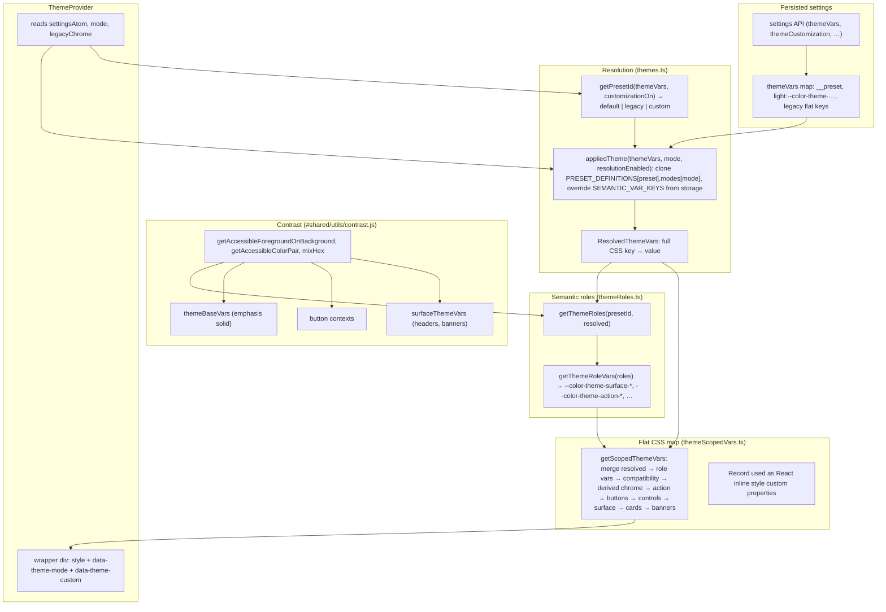
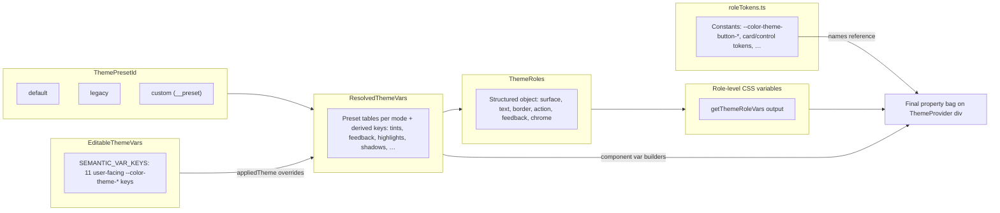
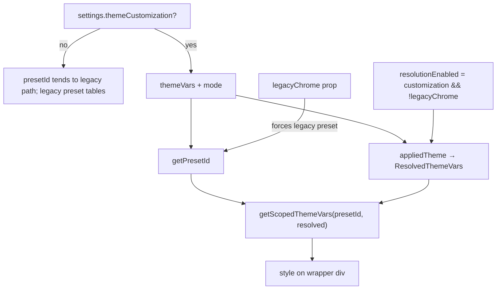

# V2 theming architecture

This document describes how tenant-customizable colors flow from settings to CSS custom properties on the page, and how **presets**, **resolved variables**, **roles**, and **component tokens** relate. For class-to-token migration, see [theme-migration-guide.md](./theme-migration-guide.md).

Primary implementation paths:

- `app/react/V2/theme/tokens.ts` — semantic keys, preset tables, `ResolvedThemeVars` shape
- `app/react/V2/theme/themes.ts` — `appliedTheme`, `getPresetId`, compatibility aliases
- `app/react/V2/theme/themeRoles.ts` — `ThemeRoles`, `getThemeRoleVars`
- `app/react/V2/theme/themeScopedVars.ts` — `getScopedThemeVars` (final merge)
- `app/react/V2/theme/ThemeProvider.tsx` — React injection
- `app/react/V2/theme/roleTokens.ts` — string constants for component-level CSS variable names
- `app/shared/utils/contrast.js` — accessible foreground / color pairs used when deriving UI colors

## End-to-end data flow

## Presets, editable vars, roles, and tokens

## ThemeProvider and flags

## Merge order

`getScopedThemeVars` builds one object by spreading layers in a fixed order. Later layers can supply or override keys set by earlier ones. The intended sequence is:

1. `resolved` (full palette for the active mode)
2. `getThemeRoleVars(roles)`
3. `toCompatibilityVars(resolved)` (short and legacy alias names)
4. `getDerivedThemeVars` (brand chrome surface variables from roles)
5. `getActionThemeVars` (emphasis solid pair from contrast)
6. `getButtonThemeVars`
7. `getControlThemeVars`
8. `getSurfaceThemeVars`
9. `getCardThemeVars`
10. `getBannerThemeVars`

## Which CSS variable should I use?

Use the **left column** for new V2 UI inside `ThemeProvider`. Variables from `getThemeRoleVars` are semantic (surface, action, feedback, chrome). **Resolved** names are the canonical storage keys from presets and customization. **Compatibility** short names exist for older CSS; prefer not to introduce them in new components. **Component tokens** (`roleTokens.ts`) are for specific widgets (buttons, inputs, card headers) and are filled in late merge steps, so they already encode contrast and preset quirks.

| UI intent                               | Preferred variable                                         | Same idea (resolved / compat)                       | Notes                                             |
| --------------------------------------- | ---------------------------------------------------------- | --------------------------------------------------- | ------------------------------------------------- |
| App / page canvas                       | `--color-theme-surface-page`                               | `--color-theme-bg-primary`, `--bg-primary`          | Role maps 1:1 from `bg-primary`.                  |
| Raised surface (cards, panels)          | `--color-theme-surface-raised`                             | `--color-theme-bg-surface`, `--bg-surface`          |                                                   |
| Warm band                               | `--color-theme-surface-warm`                               | `--color-theme-bg-warm`, `--bg-warm`                |                                                   |
| Muted blocks                            | `--color-theme-surface-muted`                              | `--color-theme-bg-muted`, `--bg-muted`              |                                                   |
| Overlay / scrim                         | `--color-theme-surface-overlay`                            | `--color-theme-bg-overlay`, `--bg-overlay`          |                                                   |
| Selected background                     | `--color-theme-surface-selected`                           | `--color-theme-bg-selected`, `--bg-selected`        |                                                   |
| Primary body text                       | `--color-theme-text-primary`                               | `--text-primary`                                    | Role `text.primary` equals resolved.              |
| Secondary / tertiary / muted text       | `--color-theme-text-secondary` (etc.)                      | `--text-secondary`, …                               |                                                   |
| Text safe on primary accent             | `--color-theme-text-on-solid`                              | —                                                   | Computed for contrast on action primary.          |
| Default border                          | `--color-theme-border-default`                             | `--color-theme-border-primary`, `--border-primary`  |                                                   |
| Interactive / focus border (controls)   | `--color-theme-control-border-focus` (`roleTokens`)        | —                                                   | Control vars use `roles.border.focus`.            |
| Accent / brand primary                  | `--color-theme-action-primary`                             | `--color-theme-accent-primary`, `--accent-primary`  | Hover: `--color-theme-action-primary-hover`.      |
| Primary-on-accent (e.g. link on brand)  | `--color-theme-action-primary-fg`                          | —                                                   |                                                   |
| Secondary control surfaces              | `--color-theme-action-secondary-`*                         | —                                                   |                                                   |
| Info / success / warning / danger       | `--color-theme-feedback-*`                                 | `--color-theme-success`, `--danger`, …              | Danger aligns with emphasis accent in roles.      |
| Top chrome / app bar                    | `--color-theme-chrome-app-bar` (+ hover/active/fg)         | `--color-theme-brand-surface` family (`roleTokens`) | Derived chrome vars alias bar colors.             |
| Solid destructive emphasis              | `--color-theme-accent-emphasis-solid`                      | —                                                   | Pair with `-foreground`; from contrast on danger. |
| Primary / status / embedded **buttons** | `--color-theme-button-`* via `roleTokens`                  | —                                                   | Do not hand-roll fills from accent alone.         |
| Inputs, selects                         | `--color-theme-control-*` via `roleTokens`                 | —                                                   |                                                   |
| Card headers, banners                   | `CARD_*`, `INFO_BANNER_*`, `WARNING_*`, `SECTION_HEADER_*` | —                                                   | See `surfaceThemeVars.ts`.                        |

When in doubt: **role variable for layout and semantics**, `**roleTokens` constant for a specific component variant**, **resolved keys** when persisting or editing the 11 customizable semantic entries in settings.